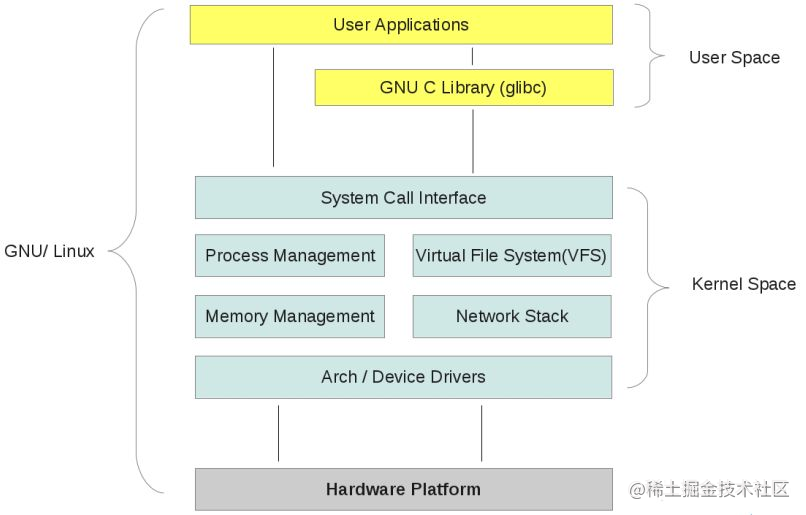
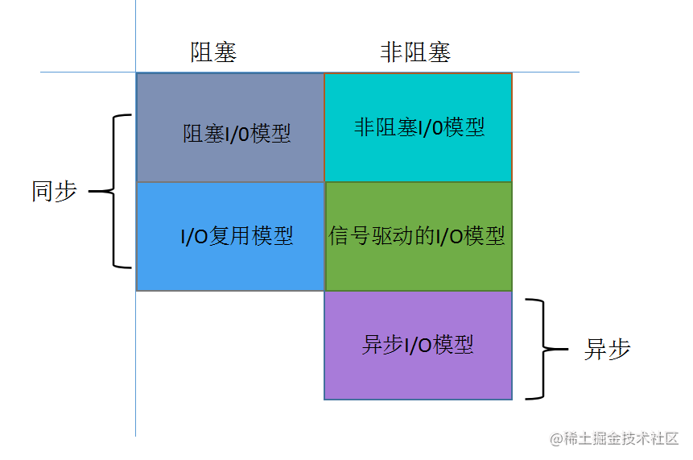
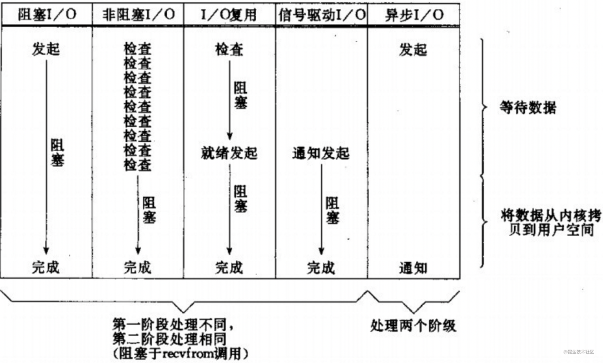

# Linux中IO模型

## 五种IO模型

- 一个IO操作实际上分为两个步骤，第一是发起io操作，第二步是实际的io操作, 从内核拷贝数据到用户空间。 阻塞不阻塞，看第一步，异不异步，看第二步。

- 同步/异步: 是指调用在没有得到结果前，是否会返回, 描述的是用户线程与内核的交互方式
- 阻塞/非阻塞: 是指执行者（线程）在调用执行完成之前，是否会阻塞线程, 描述的是用户线程调用内核IO操作的方式

- 同步阻塞IO: 优点是能够及时返回数据，无延时，实现简单。缺点是性能差
- 同步非阻塞IO: 优点是等待任务完成的时间内可以做其他任务。缺点是需要轮询，整体吞吐量不高
- IO多路复用: select、poll和epoll等，可以同时处理多个网络连接IO。通过这些系统调用，使得原来多次系统调用变成了一次系统调用+内核层遍历文件描述符, 高性能程序使用最多的一种方式
- 异步非阻塞: aio及libevent, ,发起aio_read系统调用后，就可以做其他事情了, IO的两个阶段都是非阻塞的。Linux下异步IO其实用的很少，缺点是增加了复杂性, 但性能优势不明显

## select

- select不允许多于一个的线程在同一个描述符集上等待，因此不是高性能，因为他没有有效的利用硬件的并行性
- 非阻塞io，io复用，信号驱动io。都是非阻塞的，采用的主动查询外设状态。poll和select是主动查询，不同的是select何poll可以同时查询多个文件描述符，但select有文件描述符数量限制。 而epoll采用的是回调函数式的。 信号驱动机制则是基于信号消息的。 这应该归属于被动接受消息
- select每次都会将文件描述符从用户态拷贝到内核态
- select每次需要遍历全部的文件描述符
- select同时可打开的文件描述符有限，是32*32=1024

## epoll

- epoll需要判断下就绪列表是否为空，而select需要不断遍历整个fd集合
- epoll使用红黑树结构，一个就绪列表，少量core cache，解决了大并发下的socket问题
- 执行epoll_create时，创建了红黑树和就绪链表
- 执行epoll_ctl时，如果增加socket句柄，则检查在红黑树中是否存在，存在立即返回，不存在则添加到树干上，然后向内核注册回调函数，用于当中断事件来临时向准备就绪链表中插入数据
- 执行epoll_wait时立刻返回准备就绪链表里的数据即可
- epoll使用mmap完成内存共享