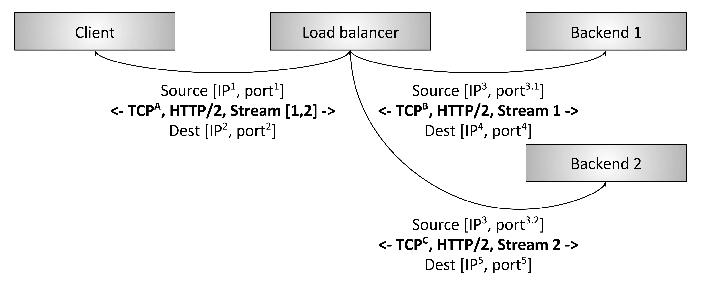

# 负载均衡

> 负载平衡（loadbalancing）是一种电子计算机技术,用来在多个计算机（计算机集群）、网络连接、CPU、磁盘驱动器或其他资源中分配负载,以达到优化资源使用、最大化吞吐率、最小化响应时间、同时避免过载的目的。使用带有负载平衡的多个服务器组件,取代单一的组件,可以通过冗余提高可靠性。负载平衡服务通常是由专用软件和硬件来完成。主要作用是将大量作业合理地分摊到多个操作单元上进行执行,用于解决互联网架构中的高并发和高可用的问题。

若干客户端正在访问若干后端服务,中间的负载均衡器完成以下功能：

- 服务发现：系统中哪些后端可用、它们的地址是什么（负载均衡器如何能够联系上它们）。
- 健康检查：哪些后端是健康的,可以正常接收请求。
- 负载均衡：用哪种算法来均衡请求至健康的后端。

在分布式系统中正确地使用负载均衡可以带来这些好处：

- 命名抽象化：客户端无需知道每个后端（服务发现）,只要能找到负载均衡器就行了,名称解析委托给负载均衡器。
- 容错：通过健康检查和各种算法,负载均衡器可以有效地绕开不良或超载的后端。
- 开销和性能优势：分布式系统的网络很少是同构的,系统很可能跨多个网络zone和region。负载均衡可以最大限度地将请求流量保持在zone内部,即提高性能（更低的延迟）又降低整体系统成本（减少跨zone带宽）。

## L4层负载均衡

L4 LB的特点也是其缺点,设想如下L4特殊场景:两个gRPC/HTTP2客户端们通过L4 LB建立连接到后端,L4 LB为每个（从客户端）进来的连接建立一个出去的（到后端）的连接,因此最终有两个进来的连接和两个出去的连接。客户端A的连接每分钟发送1个请求,而客户端B的连接每秒发送50个请求。以上场景中,由于L4同一个session的字节永远落到同一后端,选中的处理客户端A请求的后端比选中的处理客户端B请求的后端,负载要相差很多倍,这就与负载均衡的目的背道而驰。由于性能考虑（创建TCP连接的开销是非常大,尤其是连接是使用TLS加密的时候）,所有现代协议都在演进以支持multiplexing（多路复用）和kept-alive（连接保活）,因此L4 LB的阻抗不匹配问题随时间越来越彰显。

## L7层负载均衡

L7HTTP/2负载均衡器。这种情况下,客户端与LB只建立一个HTTP/2TCP连接。LB接下来和两个后端建立连接。当客户端向LB发送两个HTTP/2流（streams）时,stream1会被发送到后端1,而stream2会被发送到后端2。因此,即使不同客户端的请求数量差异巨大,这些请求也可以被高效地、平衡地分发到后端。L7负载均衡具备检测应用层流量的能力,这就是L7 LB对现代协议如此重要的原因。

## L4与L7层对比

虽然在service-to-service通信中L7负载均衡最终会完全取代L4负载均衡,但L4负载均衡在边缘仍然是非常有用的,因为几乎所有的现代大型分布式架构都是在公网流量入口使用L4/L7两级负载均衡架构。在边缘L7负载均衡器之前部署L4负载均衡器的原因:

- L7 LB承担的更多工作是复杂的分析、变换、以及应用流量路由,他们处理原始流量的能力（按每秒处理的包数和字节数衡量）比经过优化的L4负载均衡器要差。这使得L4 LB更适合处理特定类型的攻击,例如SYN泛洪、通用包（genericpacket）泛洪攻击等
- L7 LB部署的更多更频繁,bug也比L4 LB多。在L7之前加一层L4 LB,可以在调整L7部署的时候,对其做健康检查和流量排除（drain）,这比（单纯使用）现代L4 LB要简单的多,后者通常使用BGP和ECMP（后面会介绍）
- L7 LB功能更复杂,它们的bug也会比L4多,在前面有一层L4 LB能及时将有问题的L7 LB拉出

## 负载均衡的特性

### 服务发现

服务发现是负载均衡器判断它有哪些可用后端的过程。用到的方式差异很大,这里给出几个例子：

- 静态配置文件
- DNS
- Zookeeper,Etcd,Consul等待
- Envoy的通用数据平面API

### 健康检查

健康检查是负载均衡器判断它的后端是否可以接收请求的过程。大致分为两类：

- 主动：LB定时向后端发送ping消息（例如,向/healthcheck发送HTTP请求）,以此测量后端健康状态
- 被动：LB从数据流中检测健康状态。例如,L4 LB可能会认为如果一个后端有三次连接错误,它就是不健康的；L7 LB可能会认为如果后端有503错误码就是不健康的

### load balance

LB必须保证负载是均衡的。给定一组健康的后端,如何选择哪个后端来处理一个连接或一个请求呢？负载均衡算法是一个相对活跃的研究领域,从简单的随机选择、RoundRobin,到更复杂的考虑各种延迟和后端负载状态的算法。

### 黏性会话

对于一些特定应用,保证属于同一session的请求落到同一后端非常重要。这可能需要考虑缓存、结构复杂的临时状态等问题。session的定义也并不相同,可能会包括HTTPcookies、客户端连接特性（properties）,或者其他一些属性。

### 可观测性

网络在本质上是不可靠的,LB通常需要导出统计、跟踪和日志信息,以帮助运维判断出了什么问题并修复它。负载均衡器输出的可观测性数据差异很大。高级的负载均衡器提供丰富的输出,包括数值统计、分布式跟踪以及自定义日志。需要指出的是,丰富的可观测数据并不是没有代价的,负载均衡器需要做一些额外的工作才能产生这些数据。但是,这些数据带来的收益要远远大于为产生它们而增加的那点性能损失。

### 安全和DoS防御

尤其在边缘部署拓扑情况下,负载均衡器通常需要实现很多安全特性,包括限速、鉴权和DoS防御（例如,给IP地址打标签及分配标识符、tarpitting等等）

## 方案对比

### LVS

- 抗负载能力强、是工作在网络4层之上仅作分发之用,没有流量的产生；
- 配置性比较低,这是一个缺点也是一个优点,因为没有可太多配置的东西,所以并不需要太多接触,大大减少了人为出错的几率；
- 工作稳定,自身有完整的双机热备方案；
- 无流量,保证了均衡器IO的性能不会收到大流量的影响；
- 应用范围比较广,可以对所有应用做负载均衡；
- LVS需要向IDC多申请一个IP来做VisualIP,因此需要一定的网络知识,所以对操作人的要求比较高

### HAProxy

- HAProxy是工作在网络7层之上。
- 能够补充Nginx的一些缺点比如Session的保持,Cookie的引导等工作
- 支持url检测后端的服务器出问题的检测会有很好的帮助。
- 更多的负载均衡策略比如：动态加权轮循(DynamicRoundRobin),加权源地址哈希(WeightedSourceHash),加权URL哈希和加权参数哈希(WeightedParameterHash)已经实现
- 单纯从效率上来讲HAProxy更会比Nginx有更出色的负载均衡速度。
- HAProxy可以对Mysql进行负载均衡,对后端的DB节点进行检测和负载均衡。

### Nginx

- 工作在网络的7层之上,可以针对http应用做一些分流的策略,比如针对域名、目录结构；
- Nginx对网络的依赖比较小；
- Nginx安装和配置比较简单,测试起来比较方便；
- 也可以承担高的负载压力且稳定,一般能支撑超过1万次的并发；
- Nginx可以通过端口检测到服务器内部的故障,比如根据服务器处理网页返回的状态码、超时等等,并且会把返回错误的请求重新提交到另一个节点,不过其中缺点就是不支持url来检测；
- Nginx对请求的异步处理可以帮助节点服务器减轻负载；
- Nginx能支持http和Email,这样就在适用范围上面小很多；
- 不支持Session的保持、对Bigrequestheader的支持不是很好,另外默认的只有Round-robin和IP-hash两种负载均衡算法
