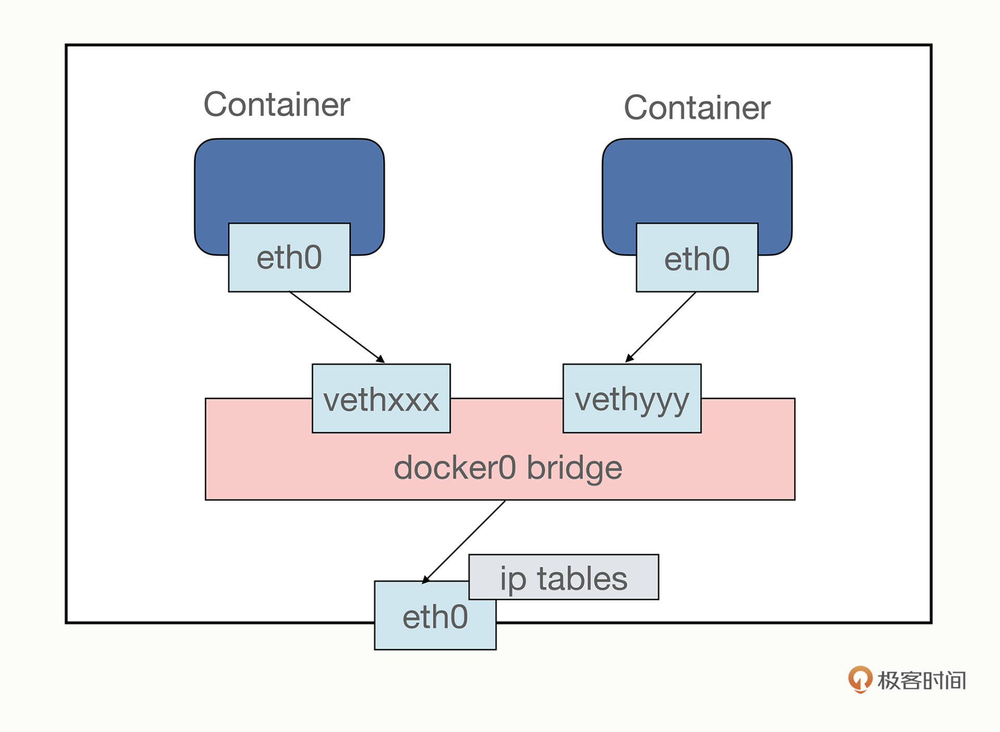

# docker

> 轻量级的操作系统级别虚拟化解决方案, Build once, configure once and run anywhere

## 优点

- 敏捷
  - 更快的交付与部署
  - 更高效的虚拟化、内核级虚拟化，不需要hypervisor（所有虚拟化的核心，虚拟机监视器）
  - 更轻松的迁移和扩展
  - 更简单的管理
- 高性能

## 适用场景

- web应用的自动化打包和发布
- 自动化测试与持续集成、发布
- 在服务型环境中部署和调整数据库或其他的后台应用
- 从头编译或者搭建自己的paas 环境

## 核心原理

使用以下操作系统的功能来提高容器技术效率

- Namespaces 确保一个容器中只运行一个进程而且不能看到或影响容器外的其他进程
  - ipc
  - Network
  - UTS  : 主机与域名
  - Mount
  - pid
- Control Groups 是LXC的重要组成部分，具有资源核算与限制的关键功能
- Union FS作为容器的构建块，为了支持Docker的轻量级以及速度快的特性
  - 将多个不同位置的目录联合挂载到同一个目录下
  - 将一个readonly branch 和 writeonly branch 联合在一起
  - 只读层 + init层 + 可读写层

- 通过 copy on write 机制实现容器的新增和修改
- 通过白障机制实现删除
- 容器只是一个特殊的进程而已，容器是单进程的意思不是只能运行一个进程，而是只有一个进程是可控的

- Docker只要求宿主机操作系统在内核3.10以上，系统为64位
- Docker Container 负责应用程序的运行，包括操作系统、用户添加的文件以及元数据
- Docker images是一个只读模板，用来运行docker容器
- Docker File 是文件指令集，用来说明如何自动创建Docker镜像

## 架构

- 服务端: 一个服务进程，管理着所有容器docker Daemon运行于主机上，处理服务请求
- 客户端: 服务端远程控制器，可以控制docker的服务端进程

## 网络



- docker启动时，会自动在主机上创建一个docker0的虚拟网桥  
- 容器的网络拓扑是否已经互连，默认情况下所有容器都会连接到docker0 网桥上
- 默认情况下，容器是可以访问外部网络的连接，但是外部网络无法访问到容器，使用-p时，本质还是在iptable上的nat表中添加相应规则
- docker服务会默认创建一个eth0的网桥，它在内核层联通了其他物理和虚拟网络，这样就将容器和本地主机都放到了同一个物理网络
- docker会通过iptables创建一条nat，把宿主机打到映射端口数据包通过转发到docker0的网关，docker0再通过广播找到对应ip的目标容器
- 容器连接，linking会创建一种父子级别的关系，父container可以看到子container提供的信息
- overlay网络是最主流的容器跨节点传输和路由方案

## DockerFile

- 每个镜像都源于一个基本的镜像，然后根据Dockerfile中的指令创建模板，对于每个指令，在镜像上创建一个新的层面，一旦镜像创建完成，就可以将它们推送到registry中
- 当容器被启动后，一个读写层会被添加到镜像的顶层，当分配到合适的网络和IP地址后，就可以运行

```shell
//DockerFile 语法
CMD 提供容器默认的执行指令，只允许使用一次CMD指令
EXPOSE 指定容器在运行时监听的端口
ENTRYPOINT 配置给容器一个可执行的命令，使用镜像创建容器时一个特定的应用程序可以被设置为默认程序
ADD 复制文件指令
WORKDIR 指定 RUN  CMD 与ENTRYPOINT 命令的工作目录
ENV 设置环境便令。 使用键值对
VOLUME  授权访问从容器内到主机的目录
```

## Docker Run时发生了什么

- 检查本地是否有该镜像，若没有则立即启动下载
- 利用镜像创建并启动容器
- 分配一个文件系统，并在只读镜像层外挂载一层可读写层
- 从宿主主机配置的网桥接口中，桥接一个虚拟接口到容器中去
- 从地址池中配置一个ip地址给容器
- 执行用户指定的应用程序
- 容器执行完毕后被中止

## 跨平台

跨平台依赖的是docker引擎，docker引擎的核心是dockerd， 它负责管理容器、镜像、网络和存储等资源，并提供API接口。  
容器使用的内核和宿主机使用的内核是一致的。 如果应用依赖内核版本，就无法跨平台。 Dokcer并不像传统的虚拟机一样运行一个完整的操作系统，而是在宿主机上运营一个隔离的用户空间，该用户空间与宿主机共享同一个内核。正是因为这个特性，使docker能够更高效的资源利用效率以及更快的启动时间

- Windows: 基于Hyper -V虚拟化技术实现, Windows系统会给容器外面套一个vm，，所以也能运行linux容器
- Mac: 基于xhyve虚拟化技术实现的
- Linux: 是真正的容器
