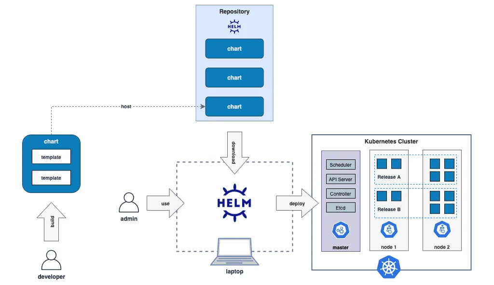

# helm

> Kubernetes是云原生操作系统的话，Helm是操作系统之上的应用商店和包管理工具

Helm是一种系统性管理和封装Kubernetes应用的解决方案, 本质就是Kubernetes的包管理器, 使用Helm不用需要了解Kubernetes的yaml语法, 可以一键安装应用

## 使用场景

- 高度可配置: Helm Charts提供了高度可配置的选项, 可以轻松自定义和修改应用程序的部署配置
- 版本控制: Helm允许管理应用程序的多个版本, 从而轻松实现版本控制和回滚
- 模板化：Helm Charts使用YAML模板来定义Kubernetes对象的配置, 从而简化了配置过程, 并提高了可重复性和可扩展性
- 应用程序库：Helm具有应用程序库的概念, 可以轻松地共享和重用Helm Charts, 从而简化了多个应用程序的部署和管理

## 核心概念

| 概念       | 描述                                                                                                                                                |
| :--------- | :-------------------------------------------------------------------------------------------------------------------------------------------------- |
| Chart      | 打包格式，内部包含了一组相关的kubernetes资源                                                                                                        |
| Repoistory | Helm 的软件仓库，用于存储 Charts                                                                                                                    |
| Release    | 在 kubernetes上运行的Chart实例，例如 一个 Redis Chart想要运行两个实例，可以将Redis Chart install两次，并在每次安装生成自己的Release以及Release 名称 |
| Value      | Chart参数，用于配置kubernetes对象                                                                                                                   |
| Template   | 使用Go模版语言生成的kubernetes对象的定义文件                                                                                                        |



## 应用示例

```shell
WordPress
.
├── Chart.lock
├── Chart.yaml
├── README.md
├── templates
│   ├── NOTES.txt
│   ├── _helpers.tpl
│   ├── config-secret.yaml
│   ├── deployment.yaml
│   ├── hpa.yaml
│   ├── svc.yaml
│   └── ...
├── values.schema.json
└── values.yaml
```

配置文件:

- Chart.yaml: 应用的详细信息, 包括名称、版本、许可证、自述、说明等
- values.yaml: 所有可配置项目的预定义值

提供了应用生命周期、版本、依赖项的管理功能，同时还支持额外的插件扩展, 能加入CI/CD或者其他方面的辅助功能