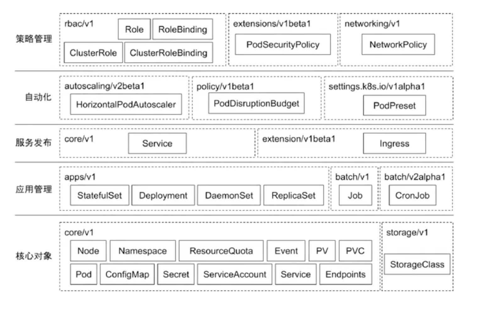
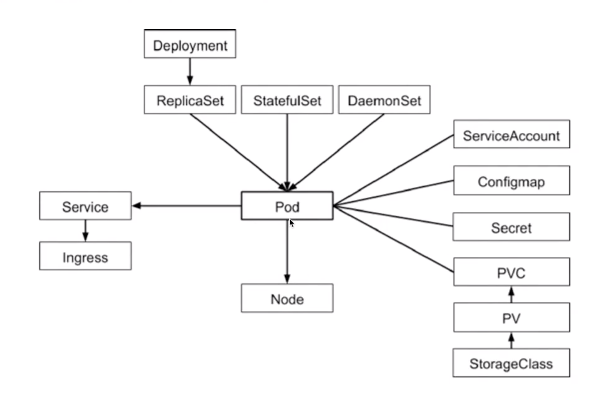

# kubernetes

> kubernets 生产级别的容器编排平台和集群管理系统，应用的开发、部署、运维等一系列工作。提供了一个以容器为中心的基础架构，提供应用层的功能，负载均衡/日志/监控/检查检测/自动重启/自动复制/自动部署/自动伸缩

云原生就是kubernetes原生的意思

## 设计思想

一旦要追求普适性，那就一定要从顶层开始做好设计

- 声明式API: 一切都是资源, 自动化, 兼顾性能、API完备性、版本化、向后兼容等很多工程化指标
- 控制器模式: 循环控制, 让状态达到最终一致性
- 自定义CRD: CRD(Custom Resource Definition), 自定义API资源
- 插件机制: 支持CSI、CRI不同的实现
- 调度: 把一个容器按照某种规则，放置到某个最佳节点上运行起来
- 编排: 按照用户的意愿以及整个系统的规则，完全自动化地处理好容器之间的各种关系

## 架构

- master： API、Schedule、Manager, 默认情况下master节点是不允许运行用户的pod， 但可以依靠kubernetesd 的Taint/Toleration机制 实现可以调度
- node：kubelet, CRI（Container Runtime interface）， Device Plugin， CNI（Container Networking Interface）和CSI（Container Storage Interface）

核心组件:

- etcd保存了整个集群的状态
- apiserver提供了资源操作的唯一入口，并提供认证、授权、访问控制、API注册和发现等机制
- controller manager 负责维护集群的状态，比如故障检测，自动扩展，滚动更新等
- scheduler 负责资源的调度，按照预定的调度策略将pod调度到相应的机器上
- kubelet负责维护容器生命的声明周期，也负责Volume（CVI）和网络CNI的管理
- container runtime 负责镜像管理以及pod和容器的真正运行（CRI）
- kube-proxy负责为service提供cluster内部的服务发现和负责均衡
- federation 提供跨可用区的集群

## 基本组件

- 类型
  - 资源对象：Pod、ReplicaSet、Deployment、StatefuleSet、DaemenSet
  - 存储对象：volume、PersistentVolume、Secret、ConfigMap
  - 策略对象：securityContext、ResourceQuota、LimitRange
  - 身份对象：serviceAccount、role、clusterRole

### etcd

- 保存所有的网络配置
- 保存所有对象的状态信息，元信息配置

### kubelet

kubelet管理master和node之间的通信，管理机器上运行的pods和containers容器, 由systemd托管的， 是k8s 的init system。 可以通过指定目录的方式将k8s的核心组件全部拉起

- 从不同资源获取pod清单，并按照需求启停pod的核心组件
- 上报node的健康及相关信息
- 上报pod的健康及相关信息

### api-server

- API Server只保证更新数据到etcd中，以及通知监听的客户端有变更的动作
- 控制器执行循环，负责将实际状态调整为期望的状态，控制器之间也不会相互通信

api-server 准入，授权，认证，只有api-server可以直接访问etcd，并且watch了etcd的全部变化
api-server也是支持watch的  kubectl -w就是订阅了watch
control manager 是watch变化，然后不断重试，然后达到最终一致性

### scheduler

调度器只是给pod分配节点, schedule 的顺序

- prefilter 过滤
- predict 预测
- priority  优先级
- bind 绑定

- 节点污点: 可以自定义污点和容忍度 key:value  effect
  - NoSchedule
  - NoExecute: 在节点上运行着的pod，将会从这个节点去除
  - PreferNoSchedule
- 节点容忍度: Pod Tolerate
- 节点亲缘性: Pod Affinity,  将pod只调度到某几个节点上
- 节点反亲和性: Pod Anti Affinity

### kube-proxy

监控service的配置，并完成负载均衡的配置

### pod

Pod是一组紧密关联的容器集合， Pod的IP会随着Pod的重启而变化，共享网络地址和文件系统
每个API对象都有3大类属性： 元数据metadata、规范spec和状态status

Pod 是一个或多个容器组合起来的共享资源，例如存储/网络/容器运行的信息, pod中的容器共享ip和端口
在pod中的容器之间共享进程命名空间，从而使改pod中的所有其他容器都是可见的
Qos优先级  

- Guaranteed Pod， 必须同时指定内存和CPU的限制
- Bursting Pod，至少一个容器具有内存或CPU要求
- Best Effort, 必须没有设置内存和CPU限制或请求
资源回收策略
- 可压缩资源：CPU属于可压缩资源，当Pod使用超过其设置的limits值时，
- 不可压缩资源：内存是不可压缩资源，当资源不足时先kill低优先级的pod

pod结构

- annotation 与 label 都是string map
  - annotation：不支持过滤查询， 主要是注解，用于pod结构的定义扩展
  - label：是支持过滤查询的
- finalizer 类似于锁
- resourceVersion 多线程或多进程同时修改，主要用于乐观锁， mvcc
- selfLink

livenessProbe 判断pod中的应用容器是否健康，可以理解成健康检查
readnessProbe 判断pod是否已经就绪， 可以接收请求和访问。

### 特殊pod

- init容器
  - 在容器启动之前运行， 用于运行容器中不存在的实用工具或安装脚本
  - 多个init容器会顺序执行，当所有的init容器运行完成后，才能初始化pod和运行容器
  - init容器提供了一种简单的阻塞或者延迟应用容器启动的方法
  - init容器的代码应该是幂等的
- pause容器（infra容器: 实现pod内部容器共享网络，都加入了这个pause container的namespace

### service

service服务的主要作用, 就是作为pod的代理入口, 从而代替Pod对外暴露一个固定的网络地址, 实现服务发现和负载均衡
service是一个抽象概念, 定义了pod的逻辑分组和一种访问的策略
service分为4中

- clusterIP， 在集群内部IP上暴露服务，此类型使service只能从集群访问
- nodePort， 通过每个Node上的ip和静态端口(node port) 暴露服务
- loadbalance，负责均衡，可以向外暴露服务
- externalName，通过返回CNAME和它的值，可以将服务映射到externalName字段

service是基于kube-proxy之上的四层负载均衡，在TCP-IP协议栈上进行路由转发

### deployment

deployment管理pod的的方法，叫做控制器模式。

### stateful

StatefulSet是一种特殊的Deployment，实现对应用存储状态的管理, 启动顺序、稳定域名以及存储模板，就是stateful的三个关键能力

- statefulSet直接管理的是Pod
- k8s通过headless service， 为这些有编号的pod，在DNS服务器中生成带有同样编号的DNS记录
- StatefulSet还为每一个pod分配并创建一个同样编号的PVC

statefulSet适合数据库服务，集群化管理服务等有状态服务。

### daemonset

daemonSet是后台支撑服务集， 存储，日志和监控在每个节点上支撑k8s集群运行的服务

### secret

类型:

- service account：用来访问k8s api
- opeque：base64编码的secret，用来存储秘钥等
- docker configjson：用来存储私有docker registry的认证信息

使用方式:

- 以Volume方式挂载使用
- 以环境变量方式使用

### configMap

类似Linux系统中的/etc目录:

- 设置环境变量的值
- 在容器中设置命令行参数
- 在数据卷里面创建config文件

### ingress

ingress是基于Http/Https之上的七层负载均衡，是一堆Http路由规则的集合

- ingress controller：交给社区实现，最著名的是nginx
- ingress class：解耦ingress 和 ingress controller
ingress controller的pod，由于网络隔离的原因，还需要对外通过service暴露网络

### cronjob

- 在给定的时间点只运行一次
- 周期性的在给定时间点运行

### HPA

根据检测到的metric自动的扩容 rs、deployment等

- 由控制循环实现，默认是30s
- metric可以由：Heapster和Rest客户端访问
- 支持自定义的metric：cpu、内存和qps

### 存储

CSI: 容器存储接口，提供存储资源

Volume Type:

- Empty Dir: 生命周期与pod相同，pod删除时，empty Dir也会删除，主要用于某些应用程序无需多久保存的临时目录，多个容器的共享目录等， 是Pod分配到Node上时被自动创建的
- Host Path：为pod挂载宿主机上的目录或文件，使得容器可以使用宿主机的文件系统进行存储，缺点是动态调度在不同的node上，下次调度到其他节点时，无法使用之前节点上的存储文件。（支持如果文件或目录不存在，就创建一个的功能）

storage class自动地为集群里存在的每一个pvc，调用存储插件创建对应的PV  
pv 和pvc的绑定:

- pv的存储大小必须满足pvc的要求
- pv和pvc的storage class name字段必须一样

### 网络插件

- CNI：容器网络接口，提供网络资源
  - 保证pod拥有集群内唯一的IP地址
  - 保证不同节点的IP地址划分不会重复
  - 保证跨节点的IP地址划分不会重复
  - 保证不同节点的pod可以跨节点的主机互相通信

- Flannel的作用
  - 为每个node分配subnet，容器将自动从该子网中获取IP地址
  - 当有node加入到网络时，为每个node增加路由配置

netfilter子系统的作用，就是在Linux内核里挡在网卡 和 用户态进程之间的一道 ”防火墙“, network policy其实只是宿主机上的一系列iptables的规则, 已经实现network policy的网络查件包括 calico、weave 和 kube-router, 通过控制循环的方式对network policy对象的增删改查做出响应，然后在宿主机上完成iptables规则的配置工作, 

- 基于iptables的service实现，实际是一组随机模式的iptables链
- 基于ipvs的service实现， ipvs并不需要在宿主机为每个pod设置iptables规则

- UDP: 使用flannel进程在机器之间进行转发，性能较低
- TUN设备是一种工作在三层（Network Layer）的虚拟网络设备给。 TUN设备的功能非常简单，即在操作系统内核和用户应用程序之间传递IP包
- VXLAN: 虚拟可扩展局域网
- VTEP: VXLAN Tunnel End Poin(虚拟隧道端点）， VTEP的封装和解封装对象， 是二层的数据帧

### namespace

NameSpace是Kubernetes项目里的一个逻辑管理单位，并没有提供实际的隔离或者多租户能力

## 高可用

- kubeapi-server、etcd是多实例且同时运行的
- controller manager和kube-scheduler是同时运行，但只有一个实例起作用，其他的实例处于待命状态
- 唯一能和etcd通信的，是kubeapi-server组件，其他所有组件都是通过kubeapi-server通信
- api-server实现了乐观锁机制，保证集群的状态是一致的
- kubectl 通过一个http post请求到api-server上