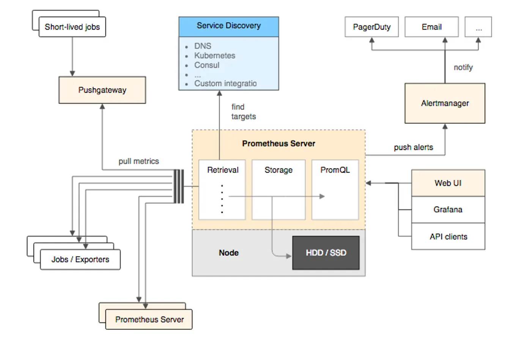

# prometheus

> prometheus 是一个开源的完整监控解决方案, 提供了从指标暴露、指标抓取、存储和可视化，以及最后的监控告警等一系列组件

| 维度     | Push                                                           | Pull                                               |
| -------- | -------------------------------------------------------------- | -------------------------------------------------- |
| 代表应用 | InfluxDB                                                       | Prometheus                                         |
| 发起者   | 被监控方发起                                                   | 监控系统发起                                       |
| 网络需求 | 目标地址固定、容易绕过防火墙                                   | 需要连接所有被监控方、通常需要与被监控方部署在一起 |
| 并发     | 容易对监控系统造成较大并发压力，导致监控系统网络拥塞或系统过载 | 可用监控系统轮训并发拉去，无并发问题               |
| 故障感知 | 若监控系统假死，被监控方无法感知                               | 若系统超负荷，数据采集会变慢，雪崩几率较小         |
| 目标发现 | 被监控目标主动上报，无需进行发现                               | 需要主动发现被监控目标                             |

## 数据索引

## 架构图

### 指标抓取

两种指标抓取模型:

- Pull模型: 监控服务主动拉取被监控服务的指标, 主动暴露metrics端口或通过Exporter的方式暴露指标
- Push模型: 被监控服务主动将指标推送到监控服务，通过pushgateway

### 指标存储和查询

- promQL查询语言做指标查询
- 第三方可视化工具，例如grafana

### 监控告警

从promql查询出来的指标超过阈值时，会发送告警到alertmanager

## 工作原理

服务注册, 被监控服务在Prometheus中是一个job存在, 被监控的服务实例是一个target存在

- 静态注册: 在配置文件中, 指定ip和端口号
- 动态注册: 在配置中配置服务发现的地址和服务名

指标数据模型

- 指标名: metric_name, 表示监控哪一方面的状态， 例如http_request_total表示监控数量
- 指标标签集合: lable_name, 指标有哪些维度, 例如请求状态码, 请求方式等, 即lable_name
- 时间戳: timestamp, 毫秒
- 样本值: value, 当前监控指标的具体数值

指标类型

- counter: 自增计数器
- gauge: 仪表盘
- histogram: 直方图类型
- summary: 直接存储百分位数

PromQL是Prometheus为我们提供的函数式查询语言，查询表达式有四种类型:

- 字符串: 只作为某些内置函数的参数出现
- 标量: 单一的数字值
- 瞬时向量: 某一时刻的时序数据
- 区间向量: 某一时间区间内的时序数据集合

AlterManager是prometheus提供的告警信息下发组件, 包含了对告警信息的分组、下发和静默等策略, 配置完成后可以在webui上看到对应的告警策略信息, 告警规则也是基于PromQL进行定制的
