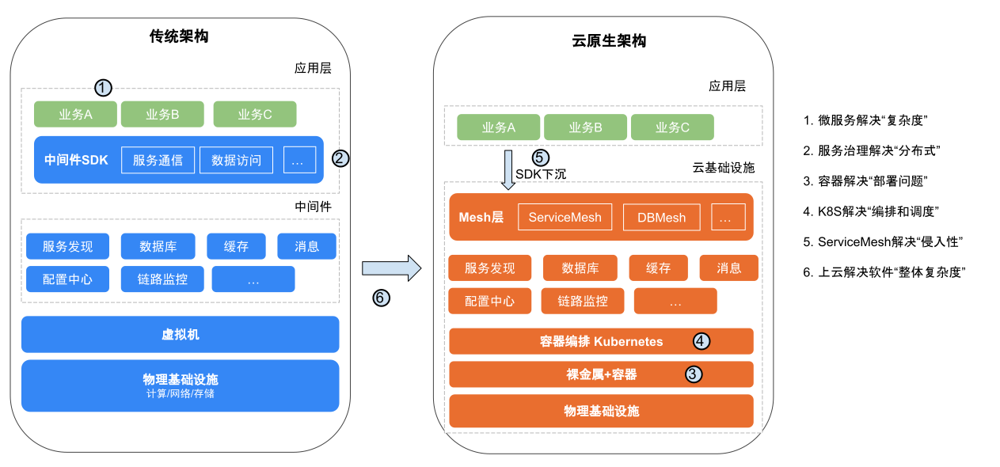

# 云原生概述

> 云原生本质是一套指导软件架构设计的思想, k8s成为云原生技术生态的底层技术标准和关键价值节点

云原生包括

- 容器化封装
- 面向微服务
- 服务网格
- 声明式API
- 不可变基础设施

## 容器技术

2015年7月21日，Google带头成立了Cloud Native Computing Foundation（CNCF，云原生基金会）。CNCF组织解决的是应用管理及容器编排问题。OCI 和 CNCF 这两个围绕容器的基金会对云原生生态的发展发挥了非常重要的作用，二者不是竞争而是相辅相成（竞争的都已经淹没在历史的长河中），共同制定了一系列行业事实标准  
至2023年，CNCF graduated 级别项目中已包括 Kubernetes、Prometheus、Helm、argo、etcd、istio、Envoy、Harbor 等众多应用，孵化级别的项目更是数不胜数。现在，CNCF 早已超出了 Kubernetes 的范畴，而是旨在建立在 Kubernetes 为底层资源调度和应用生命周期管理之上的生态系统。

## 微服务

> A microservices architecture as a service‑oriented architecture composed of loosely coupled elements that have bounded contexts.

- Loosely Coupled: 意味着每个服务可以独立的更新，更新一个服务无需要求改变其他服务
- Bounded Contexts 意味着每个服务要有明确的边界性，你可以只关注自身软件的发布，而无需考虑谁在依赖你的发布版本。微服务和它的消费者严格通过 API 进行交互，不共享数据结构、数据库、POJO等

微服务架构要实现独立部署，拥有独立的技术栈、界定上下文，明确所有权等。

### 技术挑战

微服务架构首先是一个分布式的架构，而分布式意味着复杂性的挑战，软件架构从巨石应用向微服务架构转型的过程中带来了一系列的非功能性需求，例如

- 服务发现（Service Discovery）问题，解决“我想调用你，如何找到你”的问题。
- 服务熔断（Circuit Breaker）问题，缓解服务之间依赖的不可靠问题。
- 负载均衡（Load Balancing）问题，通过均匀分配流量，让请求处理更加及时。
- 安全通讯问题，包括协议加密（TLS）、身份认证（证书/签名）、访问鉴权（RBAC）等。

解决这些问题需要编写和维护⼤量非功能性代码，这些代码与业务代码逻辑混在一起，动不动还会遇到点匪夷所思的分布式bug，如果没有做好基础设施，实现微服务会很痛苦，服务越多越悲剧。

### 后微服务时代

从软件层面独力应对微服务架构问题，发展到软、硬一体，合力应对架构问题的时代，此即为“后微服务时代”。在微服务架构中，有一些必须解决的问题，比如注册发现、跟踪治理、负载均衡、传输通讯等。这些问题可以说只要是分布式架构的系统就无法完全避免。我们先不考虑 Apache Dubbo、SpringCloud 或者别的解决方案, 被业界广泛认可、普遍采用的通过虚拟化基础设施去解决分布式架构问题的开端，应该要从2017年 Kubernetes 赢得容器战争的胜利开始算起

|          | Kubernetes              | Spring Cloud         |
| :------- | :---------------------- | :------------------- |
| 弹性伸缩 | Autoscaling             | N/A                  |
| 服务发现 | KubeDNS / CoreDNS       | Spring Cloud Eureka  |
| 配置中心 | ConfigMap / Secret      | Spring Cloud Config  |
| 服务网关 | Ingress Controller      | Spring Cloud Zuul    |
| 负载均衡 | Load Balancer           | Spring Cloud Ribbon  |
| 跟踪监控 | Metrics API / Dashboard | Spring Cloud Turbine |
| 降级熔断 | N/A                     | Spring Cloud Hystrix |

Kubernetes并未能完全解决所有的分布式问题。就功能的灵活性和强大性而言，Kubernetes 还比不上之前的Spring Cloud方案。原因在于，某些问题位于应用系统与基础设施的交界处，而微观的服务管理并不能完全在基础设施层面得到解决。举个例子，如图1-22所示，假设微服务A调用了微服务B的两个服务，即B1和B2。若B1正常运行，而 B2 持续出现500错误，那么在达到一定阈值后，就应对 B2 进行熔断，以避免引发雪崩效应。如果仅在基础设施层面处理这个问题，那就会陷入两难境地：切断 A 到 B 的网络通路会影响到 B1 的正常运作，而不切断则会持续受到 B2 错误的影响。
为了解决这一类问题，微服务基础设施很快进行了第二次进化，引入了今天被称为“服务网格“（Service Mesh）的模式

## 不可变基础设施

### 可变的基础设施

可变的基础设施通常会导致以下问题：

- **重大故障时，难以快速重新构建服务**：持续过多的手动操作，并且缺乏记录，会导致很难由标准初始化的服务器来重新构建起等效的服务
- **不一致风险**：在服务运行过程中，持续地修改基础设施配置，会像程序变量因并发修改引起的状态不一致风险。这对服务器修改而言，同样会引入中间状态，导致出现不可预知的问题

### 不可变的基础设施

> 核心思想是任何基础设施的实例一旦创建之后就变成只读状态。如需修改或升级，应该先修改基础设施的配置模版（例如 yaml 配置），修改配置模版之后使用新的实例进行替换

从基础设施的角度来看，“不可变”更倾向于传统的运维视角。例如主机部署的是Apache，现在想换成Nginx，则需要先卸载掉 Apache，然后再重新安装一个 Nginx，然后重启让系统对这次变更生效。在这个过程中，基础设施为了满足业务需求，进行了一次或多次变更，装有Apache的Linux系统这就是一个可变的基础设施。这时候，读者应该想起前面介绍的容器技术，构建镜像运行容器之后，如果出现问题，我们不会在容器内修改解决，而是在容器构建阶段去解决。从容器的角度看，镜像就是一个不可变基础设施。容器技术的出现使不同环境的标准化配置成为可能，我们可以快速拉起成千上万一模一样的服务，服务的版本升级、回滚成为常态，进而不可变基础设施也逐步变成可能。

对比可变基础设施，不可变基础设施的优点如下：

- **一致性**：在不可变基础设施下，所有的配置都通过标准化描述文件（例如 yaml、dockerfile 等）进行统一定义，不同的 Pod、Service 都按照同样的定义创建，不同实例配置不一致的情况不会再出现
- **自动化快速容灾**：当线上突发故障或者遇到异常流量时，不可变基础设施可以快速进行弹性扩缩容、升级、回滚等操作，应对问题时更加快速和自动化，大幅提升持续部署效率

## 服务网格

- service mesh的核心价值在于实现了业务逻辑与非业务逻辑的分离，serverless将其功能从服务间通信推广到计算、存储、数据库等诸多场景，越来越多使用k8s服务的应用转换成serverless应用
- 无论是Dubbo还是Spring Cloud， 都限定于应用场景和开发环境，缺少对通用性和多语言的支持，并只解决了微服务Dev层面的问题， 缺少DevOps的整体解决方案，这些为Service Mesh的兴起创造了条件
- Service Mesh通过在请求调用路径中增加sidecar， 将原本由客户端完成的复杂功能下沉到sideca中，实现对客户端的简化和服务间通信控制的转移， 当系统中存在大量服务时，服务间调用关系表现为网状， 这也是服务网关名称的由来
- Service Mesh将通信功能从应用中剥离出来，形成一个单独的通信层， 并将其下沉到基础设施层

## 云原生架构

传统架构向云原生架构演进

- 为了解决单体架构 “复杂度问题”，使用微服务架构
- 为了解决微服务间 “通讯异常问题”，使用治理框架 + 监控
- 为了解决微服务架构下大量应用 “部署问题”，使用容器
- 为了解决容器的 “编排和调度问题”，使用 Kubernetes
- 为了解决微服务框架的 “侵入性问题”，使用 Service Mesh
- 为了让 Service Mesh 有 “更好的底层支撑”，将 Service Mesh 运行在 Kubernetes 上
从单个微服务应用的角度看，自身的复杂度降低了，在 “强大底层系统” 支撑的情况下监控、治理、部署、调度功能齐全，已经符合云原生架构。但站在整个系统的角度看，复杂度并没有减少和消失，要实现 “强大底层系统” 付出的成本是非常昂贵（很强的架构和运维能力）。

为了解决项目整体复杂度，选择上云托管，将底层系统的复杂度交给云基础设施，让云提供保姆式服务，最终演变为无基础架构设计，通过 YAML 或 JSON 声明式代码，编排底层基础设施，中间件等资源，即应用要什么，云给我什么，企业最终会走向开放、标准的 “云” 技术体系。
