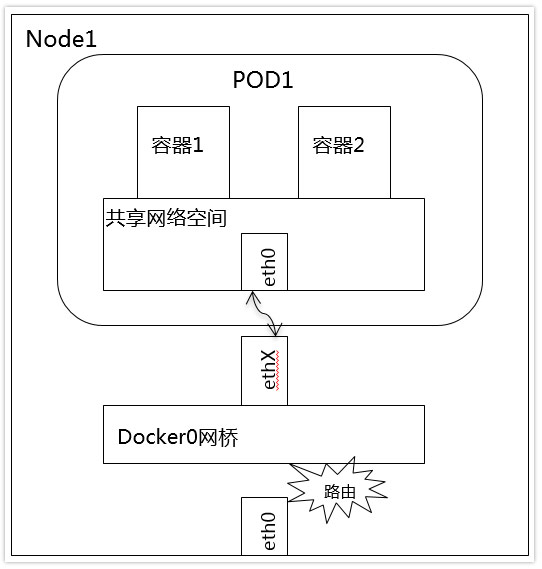
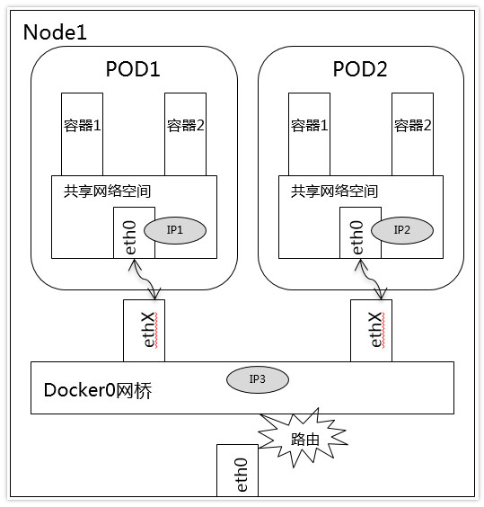
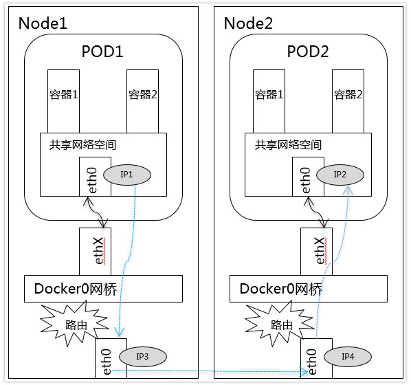
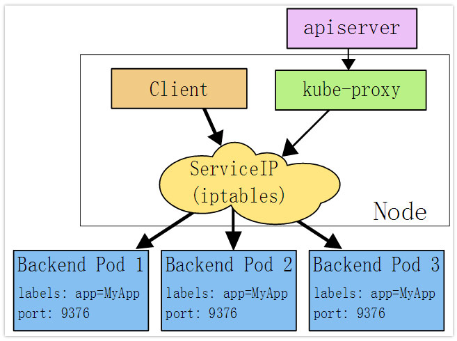
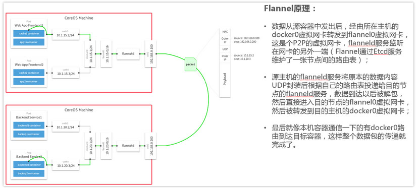
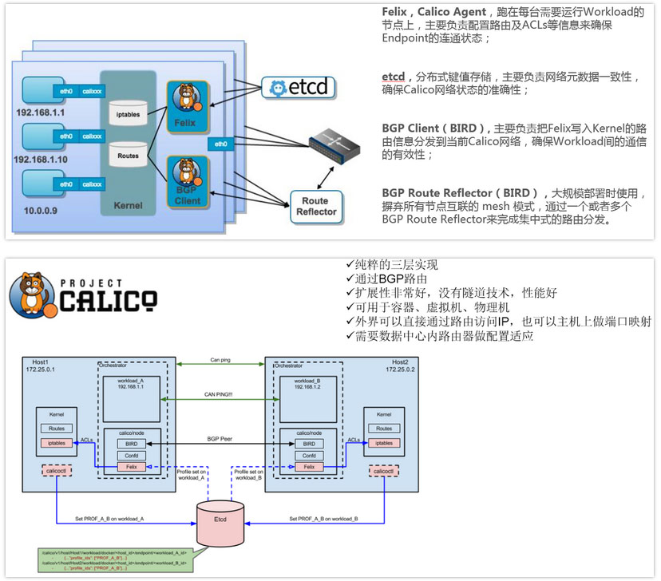

# 云原生网络

## 网络模型

在Kubernetes网络中存在两种IP

- Pod IP: 是实际存在于某个网卡(可以是虚拟设备)上的
- Service Cluster IP: 是一个虚拟IP, 是由kube-proxy使用iptables规则重新定向到其本地端口, 再均衡到后端Pod的

网络设计模型:

- 基本原则: 每个Pod都拥有一个独立的IP地址, 而且假定所有的pod都在一个可以直接连通的、扁平的网络空间中
- 设计原因: 用户不需要额外考虑如何建立Pod之间的连接, 也不需要考虑将容器端口映射到主机端口等问题
- 网络要求: 所有的容器都可以在不用NAT的方式下同别的容器通讯; 所有节点都可在不用NAT的方式下同所有容器通讯; 容器的地址和别人看到的地址是同一个地址

## 网络基础

Docker网络基础:

- Veth设备对: 实现在不同网络命名空间的通信
- Netfilter: 负责在内核中执行各种挂接的规则(过滤、修改、丢弃等), 运行在内核模式中
- Iptables: 在用户模式下运行的进程, 负责协助维护内核中Netfilter的各种规则表, 通过二者的配合来实现整个Linux网络协议栈中灵活的数据包处理机制。
- 网桥: 二层网络设备, 通过网桥可以将linux支持的不同的端口连接起来, 并实现类似交换机那样的多对多的通信
- 路由: Linux系统包含一个完整的路由功能,当IP层在处理数据发送或转发的时候,会使用路由表来决定发往哪里

Docker网络实现:

- 单机网络模式: Bridge、Host、Container、None
- 多机网络模式: 一类是Docker在1.9版本中引入Libnetwork项目, 对跨节点网络的原生支持; 一类是通过插件方式引入的第三方实现方案,比如Flannel,Calico等等

Kubernetes网络基础:

- 容器间通信: 同一个Pod的容器共享同一个网络命名空间,它们之间的访问可以用localhost地址 + 容器端口就可以访问
- 同一Node中Pod间通信: 同一Node中Pod的默认路由都是docker0的地址, 由于它们关联在同一个docker0网桥上, 地址网段相同, 所有它们之间应当是能直接通信的
- 不同Node中Pod间通信: Pod的IP不能冲突, 将Pod的IP和所在Node的IP关联起来, 通过这个关联让Pod可以互相访问

- Service: 是一组Pod的服务抽象, 相当于一组Pod的LB,负责将请求分发给对应的Pod
- Kube-proxy: 是一个简单的网络代理和负载均衡器,它的作用主要是负责Service的实现, 具体来说,就是实现了内部从Pod到Service和外部的从NodePort向Service的访问
  - 实现方式: iptables是纯采用iptables来实现LB,是目前kube-proxy默认的方式
  - kube-proxy监视Kubernetes添加和删除服务和端点对象

## 开源组件

专业术语

- IPAM: IP地址管理, 这个IP地址管理并不是容器所特有的, 传统的网络比如说DHCP其实也是一种IPAM, 到了容器时代我们谈IPAM
- Overlay: 在现有二层或三层网络之上再构建起来一个独立的网络, 这个网络通常会有自己独立的IP地址、交换或者路由的实现
- IPSesc: 一个点对点的一个加密通信协议,一般会用到Overlay网络的数据通道里
- vxLAN: 解决VLAN支持虚拟网络数量(4096)过少的问题。 因为在公有云上每一个租户都有不同的VPC, 4096明显不够用。就有了vxLAN, 它可以支持1600万个虚拟网络, 基本上公有云是够用的
- 网桥Bridge: 连接两个对等网络之间的网络设备, 但在今天的语境里指的是Linux Bridge, 就是大名鼎鼎的Docker0这个网桥
- BGP: 主干网自治网络的路由协议, 今天有了互联网, 互联网由很多小的自治网络构成的, 自治网络之间的三层路由是由BGP实现的
- SDN、Openflow: 软件定义网络里面的一个术语,比如说我们经常听到的流表、控制平面,或者转发平面都是Openflow里的术语

容器网络方案

- 隧道方案(Overlay Networking)
  - 应用场景: 在IaaS层的网络中应用也比较多
  - 缺点: 随着节点规模的增长复杂度会提升, 而且出了网络问题跟踪起来比较麻烦, 大规模集群情况下这是需要考虑的一个点
  - 示例: Weave、OVS、Flannel(UDP广播,VxLan)
- 路由方案
  - 原理: 路由方案一般是从3层或者2层实现隔离和跨主机容器互通的,
  - 优点: 出了问题很容易排查
  - 示例:
    - Calico: 基于BGP协议的路由方案,支持很细致的ACL控制,对混合云亲和度比较高。
    - Macvlan: 从逻辑和Kernel层来看隔离性和性能最优的方案,基于二层隔离,所以需要二层路由器支持,大多数云服务商不支持,所以混合云上比较难以实现

Flannel&Calico

- Flannel: 是一种覆盖网络(overlay network), 将TCP数据包装在另一种网络包里面进行路由转发和通信, 目前已经支持udp、vxlan、host-gw、aws-vpc、gce和alloc路由等数据转发方式,默认的节点间数据通信方式是UDP转发
  - 为每个node上的docker容器分配相互不想冲突的IP地址
  - 为这些IP地址之间建立一个覆盖网络, 同过覆盖网络, 将数据包原封不动的传递到目标容器内

Flannel的vxlan

Flannel的原理

- Calico: 是一个纯3层的数据中心网络方案, 能够提供可控的VM、容器、裸机之间的IP通信。不使用覆盖网络比如flannel和libnetwork等网络驱动, 它是一个纯三层的方法, 使用虚拟路由代替虚拟交换,每一台虚拟路由通过BGP协议传播可达信息（路由）到剩余数据中心
  - 在每一个计算节点利用Linux Kernel实现了一个高效的vRouter来负责数据转发,而每个vRouter通过BGP协议负责把自己上运行的workload的路由信息像整个Calico网络内传播——小规模部署可以直接互联, 大规模下可通过指定的BGP route reflector来完成
  - 节点组网可以直接利用数据中心的网络结构（无论是L2或者L3, 不需要额外的NAT或者Overlay Network
  - Calico基于iptables还提供了丰富而灵活的网络Policy,保证通过各个节点上的ACLs来提供Workload的多租户隔离、安全组以及其他可达性限制等功能

