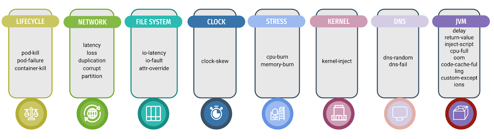

# 混沌工程

> 混沌工程 (Chaos Engineering) 是通过主动向系统中引入软件或硬件的异常状态 (扰动)，制造故障场景，并根据系统在各种压力下的行为表现，确定优化策略的一种系统性稳定性保障手段。

## 解决的问题

- 容灾能力测试
- 微服务强弱依赖治理
- 验证容器编排配置
- 监控告警
- 应急演练
- 辅助排查线上问题

## 技术架构图

## Chaos Mesh 故障能力

- Pod 故障: Pod Failure/Pod Kill/Container Kill
- 网络故障: 分区隔离/丢包/高延迟/包乱序
- 压力场景: cpu/memory
- 文件I/O故障：高延迟/系统错误/文件属性/错误值
- HTTP故障：中断连接/替换请求/增加延迟
- 时间故障
- DNS 故障
- 内核故障

除了自带的故障能力，可以自定义故障能力，以k8s CRD 的形式集成到Chaos Mesh
Chaos Mesh 平台相关能力：

- 工作流编排：串行/并行/自定义条件
- 故障实验可归档，重复使用
- 可同时管理容器故障和物理机故障
- 支持标签/namespace 等相关自选筛选