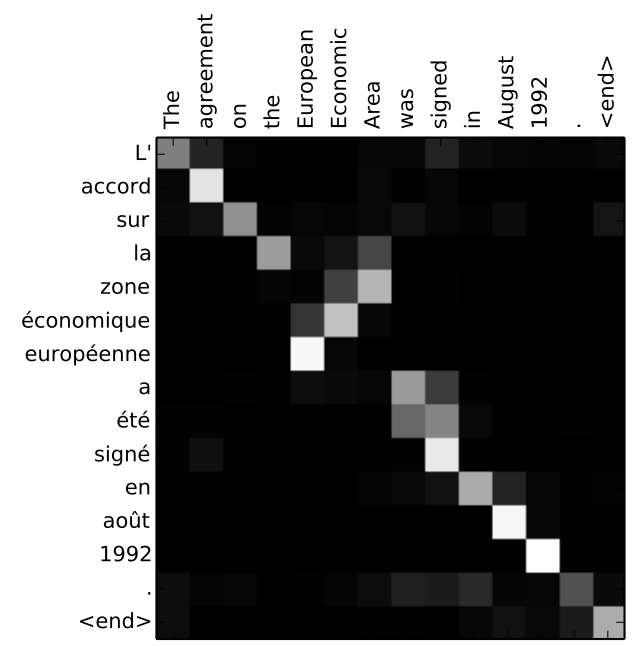

# Attention

> 给定一组向量value和一个查询query, Attention是一种分配技术, 它可以根据Query的需求和内容计算出value的加权和

可以被认为是大量信息的选择性总结归纳, 或者说是在给定一些表示的情况下,用一个固定大小的来表示任意许多其他表示集合的方法

## seq2seq框架

seq2seq是一种常见的NLP模型结构，全称是sequence to sequence，从一个文本序列得到一个新的文本序列。典型的任务有机器翻译任务、文本摘要任务

- 输入: 一个单词、字母或者图像特征序列
- 输出: 另外一个（单词、字母或者图像特征）序列
e

seq2seq模型由编码器（Encoder）和解码器（Decoder）组成。绿色的编码器会处理输入序列中的每个元素并获得输入信息，这些信息会被转换成为一个黄色的向量（称为context向量）。当我们处理完整个输入序列后，编码器把context向量发送给紫色的解码器，解码器通过context向量中的信息，逐个元素输出新的序列

深入学习机器翻译任务中的seq2seq模型, context向量本质上是一组浮点数, 那么RNN是如何具体地处理输入序列的呢？

- 假设序列输入是一个句子，这个句子可以由$n$个词表示：$sentence=\{w_1,w_2,...,w_n\}$。
- RNN首先将句子中的每一个词映射成为一个向量得到一个向量序列：$X=\{x_1,x_2,...,x_n\}$，每个单词映射得到的向量通常又叫做：wordembedding。
- 然后在处理第$t\in[1,n]$个时间步的序列输入$x_t$时，RNN网络的输入和输出可以表示为：$h_{t}=RNN(x_t,h_{t-1})$
  - 输入：RNN在时间步$t$的输入之一为单词$w_t$经过映射得到的向量$x_t$。
  - 输入：RNN另一个输入为上一个时间步$t-1$得到的hidden state向量$h_{t-1}$，同样是一个向量。
  - 输出：RNN在时间步$t$的输出为$h_t$hidden state向量。

上图左边每个单词经过wordembedding算法之后得到中间一个对应的4维的向量。

编码器首先按照时间步依次编码每个法语单词，最终将最后一个hidden state也就是context向量传递给解码器，解码器根据context向量逐步解码得到英文输出。

- 瓶颈: seq2seq模型编码器所有信息都编码到了一个context向量中
  - 单个向量很难包含所有文本序列的信息
  - 在处理长文本时面临非常大的挑战, 比如RNN处理到第500个单词的时候，很难再包含1-499个单词中的所有信息了

## Attention流程

通过attention技术，seq2seq模型极大地提高了机器翻译的质量。归其原因是attention注意力机制，使得seq2seq模型可以有区分度、有重点地关注输入序列

注意力模型与经典的seq2seq模型不同：

- 编码器会把更多的数据传递给解码器。编码器把所有时间步的hidden state传递给解码器，而不是只传递最后一个hidden state
- 注意力模型的解码器在产生输出之前，做了一个额外的attention处理
  - 由于编码器中每个hidden state都对应到输入句子中一个单词，那么解码器要查看所有接收到的编码器的hidden state
  - 给每个hidden state计算出一个分数
  - 所有hidden state的分数经过softmax进行归一化
  - 将每个hidden state乘以所对应的分数，从而能够让高分对应的hidden state（隐藏层状态）会被放大，而低分对应的hidden state会被缩小。
  - 将所有hidden state根据对应分数进行加权求和，得到对应时间步的context向量。

**attention可以简单理解为一种有效的加权求和技术，其艺术在于如何获得权重**

结合注意力的seq2seq模型解码器全流程，动态图展示的是第4个时间步：

- 注意力模型的解码器RNN的输入包括：一个wordembedding向量，和一个初始化好的解码器hidden state，图中是$h_{init}$。
- RNN处理上述的2个输入，产生一个输出和一个新的hidden state，图中为h4。
- 注意力的步骤：我们使用编码器的所有hidden state向量和h4向量来计算这个时间步的context向量（C4）。
- 把h4和C4拼接起来，得到一个橙色向量。
- 把这个橙色向量输入一个前馈神经网络（这个网络是和整个模型一起训练的）。
- 根据前馈神经网络的输出向量得到输出单词：假设输出序列可能的单词有N个，那么这个前馈神经网络的输出向量通常是N维的，每个维度的下标对应一个输出单词，每个维度的数值对应的是该单词的输出概率。
- 在下一个时间步重复1-6步骤。

**decoder的每一步, 不仅有来自encoder的隐藏层，还有来自上一时刻的输出已经上一时刻的隐藏层

可视化注意力机制

需要注意的是：注意力模型不是无意识地把输出的第一个单词对应到输入的第一个单词，它是在训练阶段学习到如何对两种语言的单词进行对应（在我们的例子中，是法语和英语）。

下图还展示了注意力机制的准确程度（图片来自于上面提到的论文）：

可以看到模型在输出"EuropeanEconomicArea"时，注意力分布情况。在法语中，这些单词的顺序，相对于英语，是颠倒的（"européenneéconomiquezone"）。而其他词的顺序是类似的。

## 优势

- 显著提高了翻译算法的表现
- 解决了信息瓶颈问题
- 减轻了梯度消失问题
- 提供了一些可解释性
