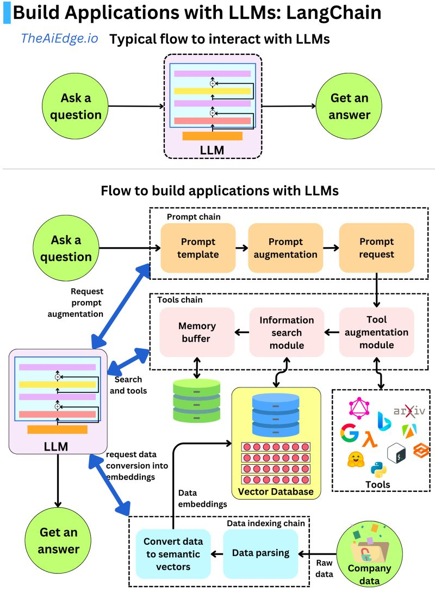

# LangChain

> 用于开发由语言模型驱动的应用程序的框架

- 上层应用和模型基座绑死。切换模型基座时，上层逻辑不得不大量修改。在 LLM 蓬勃发展的当下，无论是处于成本、License、研究热点还是性能等各方面考虑，基座变更几乎不可避免。
- 处理环节不完善，开发成本高。比如：向量存储和搜索，LLM 提示词生成，数据链路（导入、分片、加工）等等。如果全部手撸，成本过高。
- 缺少标准化。轮子不但要丰富还要标准化，以结合场景灵活编排。一个粗浅的比喻是——我们需要 “乐高” 。

## 应用场景

- 文档问答:
  - 加载文本
  - 拆分文档
  - 根据提问匹配文本
  - 构建prompt: 将匹配文本、用户提问加入prompt模板
  - LLM生成文档
- 个人助理:
- 查询表格数据:
- 与API进行交互:
- 信息提取:
- 文档总结

主要功能

- 调用语言模型
- 将不同数据源接入到语言模型交互中
- 允许语言模型与运行环境交互

## 应用构建

- model: 模型。可选择不同的LLM与Embedding模型
- prompt: 提示。g管理LLM的输入。包括prompt模版等
- index: 索引。对文档结构化的方法。包括Document Loaders（文档加载器）、Text Splitters（文本拆分器）、VectorStores（向量存储器）以及Retrievers（检索器）
- chains: 链。将LLM与其他组件结合。将各种组件统一到应用程序的方法, 可以动态的帮我们选择和调用chain或者已有工具
  - stuff: 把document一次全部传给llm模型进行总结
  - map_reduce: 会把每个document进行总结， 最后将所有document总结出的结果再进行一次总结
  - refine: 先总结第一个document,然后在第一个document总结出的内容和第二个document一起发给llm模型
  - map_rerank: 用在问题chain上，搜索答案的匹配方式
- agent: 代理。访问其他工具。Agents是LLM与工具之间的接口, Agents用来确定任务与工具
  - zero-shot-react-description: 根据工具的描述和请求内容来决定使用哪个工具
  - react-docstore: 使用ReAct框架docstore交互, 使用search 和 Lookup工具，前者用来搜，后者寻找term，举例: Wikipedia工具
  - self-ask-with-search: 使用Intermediate Answer, 为问题寻找事实答案, 如Google Search API工具
  - conversational-react-description: 为会话设置而设计的代理, 它的prompt会被设计的具有会话性，且还是会使用ReAct框架决定使用哪个工具
- memory: 记忆存储。默认LLM对历史内容没有记忆功能, memory用来管理和维护历史对话内容

## 定位

服务层: 将各种语言模型或外部资源整合, 构建实用的LLM模型

代表性框架LangChain、AutoGPT、Llama-index等

## 基于本地知识库

LangChain-ChatGLM 是一个基于ChatGLM等大语言模型的本地知识库问答实现
特点:

- 依托ChatGLM等开源模型, 可离线部署
- 基于langchain实现，可快速接入多种数据源
- 在分句、文档读取方面，针对中文场景进行优化
- 支持pdf、txt、md等文件类型接入、具备命令行demo、webui等

优化方向

- 模型微调: 对llm和embedding基于专业领域数据进行微调
- 文档加工: 在文档分段后，对每段分别进行总结, 基于总结内容语义进行匹配
- 借助不同模型能力: 在tex22sql,text2cpyher等场景需要产生代码时，可借助不同模型能力

### ChatGLM-6B

支持中英双语的对话语言模型, 基于General-Language Model(GLM)架构, 具有62亿模型

- 自我认知:
- 提纲写作:
- 文案写作:
- 信息抽取:
