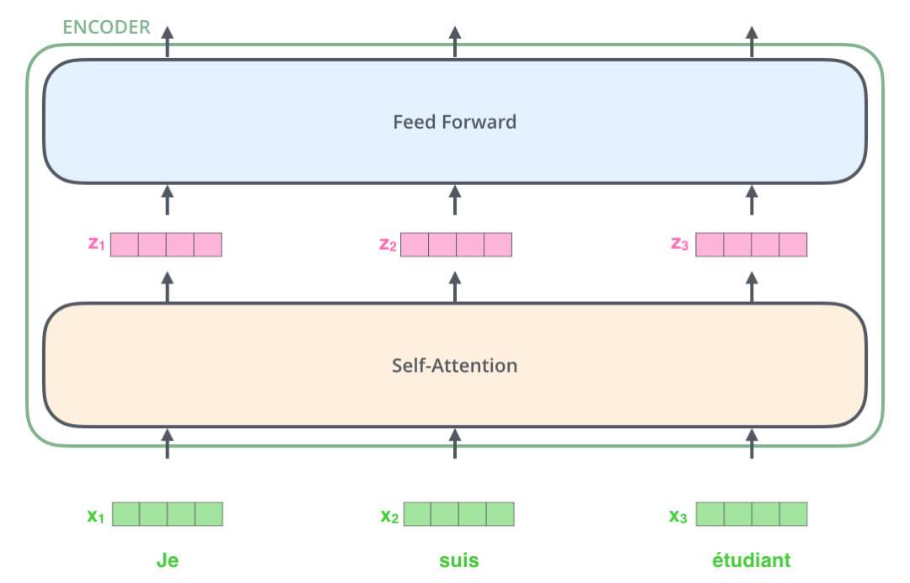

# Transformer

> 基于attention构造,不再依赖RNN、LSTM和CNN等, 并且可以对整个序列输入进行并行计算, 不需要按照时间步循环递归处理输入序列

## 语言模型

- 自编码: auto-encoder: 典型代表为bert, 通过随机mask输入的部分单词, 然后预训练的目标是被mask的单词，不仅可以融入上文信息，还可以自然的融入下文信息
  - 优点: 自然地融入双向语言模型, 同时看到被预测单词的上文和下文
  - 缺点: 训练和预测不一致。训练时引入了mask标记，但是在预测节点往往没有mask标记，导致预训练阶段和fine-tunning阶段不一致
- 自回归: auto-regressive: 根据输入句子的一部分文本来预测下一个词。
  - 优点: 对于生成类的NLP任务，比如文本摘要，机器翻译等，从左向右生成内容，天然与自回归语言模型契合
  - 缺点: 一般是从左到右，只能利用上文或者下文信息，不能同时利用上下文信息

GPT属于自回归语言模型, Transformer中的encoder进化成了BERT， Decoder进化成了GTP2

## 模型架构

Transformer宏观上属于seq2seq范畴，只是将之前seq2seq的编码器和解码器, 从RNN替换成Transformer模型

单层encoder主要由两部分组成

- self_attention layer
- feed forward neural network(前馈神经网络, FFNN)

单层decoder主要由三部分组成

- self_attention layer
- encoder-decoder attention
- feed forward

### 输入处理

- 词向量: 词嵌入算法(embedding algorithm)实际应用中的向量一般是256或512维
- 位置向量: 有助于确定每次单词的位置特征，或者句子中不同单词之间的距离特征, 位置编码有多种算法

### 编码器

self-Attention细节:

$$
1: q_1 = X_1 W^Q, q_2 = X_2 W^Q; k_1 = X_1 W^K, k_2 = X_2 W^K;v_1 = X_1 W^V, v_2 = X_2 W^V, W^Q, W^K, W^K \in \mathbb{R}^{d_x \times d_k}\\
2-3: score_{11} = \frac{q_1 \cdot q_1}{\sqrt{d_k}} , score_{12} = \frac{q_1 \cdot q_2}{\sqrt{d_k}} ; score_{21} = \frac{q_2 \cdot q_1}{\sqrt{d_k}}, score_{22} = \frac{q_2 \cdot q_2}{\sqrt{d_k}}; \\
4: score_{11} = \frac{e^{score_{11}}}{e^{score_{11}} + e^{score_{12}}},score_{12} = \frac{e^{score_{12}}}{e^{score_{11}} + e^{score_{12}}}; score_{21} = \frac{e^{score_{21}}}{e^{score_{21}} + e^{score_{22}}},score_{22} = \frac{e^{score_{22}}}{e^{score_{21}} + e^{score_{22}}} \\
5-6: z_1 = v_1 \times score_{11} + v_2 \times score_{12}; z_2 = v_1 \times score_{21} + v_2 \times score_{22}
$$

- 对输入编码器的词向量进行线性变换: Query向量(q1,q2), Key向量(k1,k2), Value向量(v1,v2)
- Query和Key计算相关或者叫attention得分,然后根据attention得分对value进行加权求和
- 把每个分数除以 $\sqrt{d_k}$，$d_{k}$是Key向量的维度。你也可以除以其他数，除以一个数是为了在反向传播时，求梯度时更加稳定。
- 把这些分数经过一个Softmax函数，Softmax可以将分数归一化，这样使得分数都是正数并且加起来等于1
- 得到每个词向量的分数后，将分数分别与对应的Value向量相乘。这种做法背理解是对于分数高的位置，相乘后的值就越大，我们把更多的注意力放到了它们身上；对于分数低的位置，相乘后的值就越小，这些位置的词可能是相关性不大的。

### 多头注意力机制

Transformer 的论文通过增加多头注意力机制（一组注意力称为一个 attention head），进一步完善了Self-Attention。这种机制从如下两个方面增强了attention层的能力：

- 扩展了模型关注不同位置的能力
- 多头注意力机制赋予attention多个子表示空间

下图中的绿色和橙色线条分别表示了2组不同的attention heads, 当我们编码单词"it"时，其中一个 attention head （橙色注意力头）最关注的是"the animal"，另外一个绿色 attention head 关注的是"tired"。因此在某种意义上，"it"在模型中的表示，融合了"animal"和"tire"的部分表达。

### 残差连接

每个子层都有一个残差连接(self attention层和 FFNN) 和层标准化(layer-normalization)

## 解码器

decoding阶段每一时间步都输出一个翻译后的单词,解码器当前时间步的输出又作为输入Q和编码的输出K、V共同作为下一个时间步解码器的输入, 然后重复这个过程

解码器中的self attention层与编码器中self attention层的区别

- 解码器层中, self Attention层只允许关注到输出序列中遭遇当前位置的单词
- 解码器Attention层, 是使用前一层输出构造Query矩阵, er

## 线性层和softmax

由线性层和softmax完成从向量到单词的转换

## 损失函数

只要Transformer解码器预测了组概率，我们就可以把这组概率和正确的输出概率做对比，然后使用反向传播来调整模型的权重,使得输出的概率更接近。 比较概率分布的方法有

- 空间距离: 向量相减、然后求平方和，再开方
- 交叉熵: cross-entropy
- KL散度: kullback-leiler divergence

目标概率分布

在足够大的数据集上，经过足够长时间的训练后,希望输出的概率分布如下图所示, 训练概率分布

- Greedy decoding: 贪婪解码, 每个模型每个时间步只产生一个输出, 模型从概率分布中选择概率最大的词,并且丢弃其他词
- Beam search: 集束搜索, 每个时间步保留k个最高概率的输出词。然后根据上一个时间步保留的k个词来确定当前应该保留哪k个词。 假设k=2，第一个位置概率最高的两个输出的词是"I"和"a"，这两个词都保留，然后根据第一个词计算第2个位置的词的概率分布，再取出第2个位置上2个概率最高的词