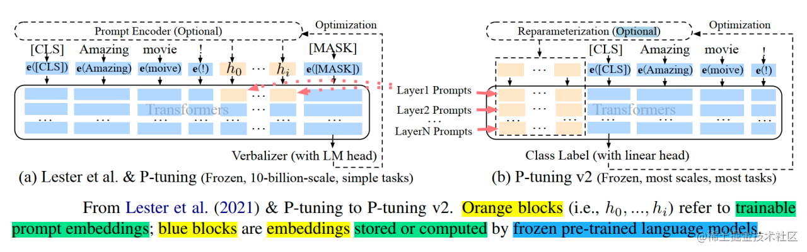
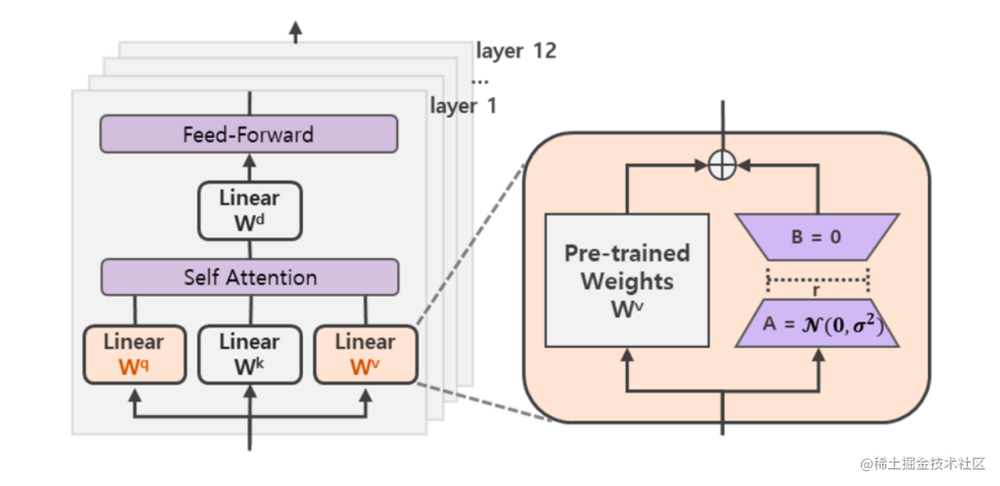
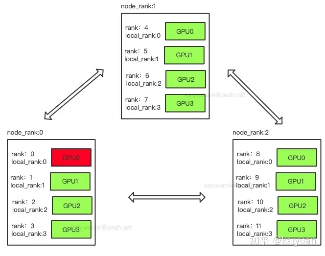
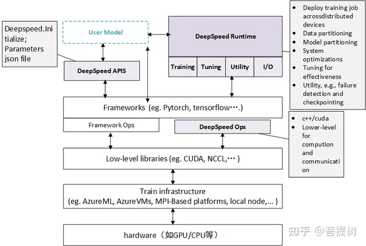

# 模型微调

> `预训练语言模型` + `下游任务微调`成为主流范式

## 原理

- Self-Attention: 自注意力机制, 更容易捕获句子中长距离的相互依赖的特征, 在计算过程中直接将句子中任意两个单词通过一个计算步骤联系起来
- Multi-Head Attention: 多头注意力机制, 由多个自注意力组成
  - 扩展了模型专注于不同位置的能力  
  - 将输入Embedding 投影到不同的表示子空间, 多个head学习到的Attention侧重点可能略有不同, 给了模型更大容量

随着`模型大小`, `数据集大小`和`训练强度`，模型性能会提高，并且为了获得最佳性能，所有三个因素必须同时放大, 当不受其他两个因素制约时，模型性能与每个单独的因素都有幂律关系
 
|            | 是什么                                                          | 适用场景                                                               |
| ---------- | --------------------------------------------------------------- | ---------------------------------------------------------------------- |
| 微调       | 针对预先训练的LLM，在特定任务的少量数据集上，对其进行进一步训练 | 当任务或域定义明确, 并且有足够标记数据可供训练时                       |
| 提示词工程 | 涉及涉及自然语言提示或指令, 可以指导语言模型执行特定任务        | 最适合需要高精度和明确输出的任务，提示工程可用于制作引发所需输出的查询 |

## LLM的区别

| 模型            | 结构            | 位置编码      | 激活函数 | layer nom 方法  |
| --------------- | --------------- | ------------- | -------- | --------------- |
| 原生transformer | Encoder/Decoder | Sinusoida编码 | ReLU     | Post layer norm |
| BERT            | Encoder         | 绝对位置编码  | GeLU     | Post layer norm |
| LLaMA           | Casual decoder  | RoPE          | SwiGLU   | Pre RMS Norm    |
| ChatGLM-6B      | Prefix decoder  | RoPE          | GeGLU    | Post Deep Norm  |
| Bloom           | Casual decoder  | ALiBi         | GeLU     | Pre Layer Norm  |

## 参数高效微调

参数高效微调是指微调少量或额外的模型参数, 固定大部分预训练模型参数，从而降低计算和存储成本, 某些场景下比全量微调效果更好  
主要分为以下三类方法:

- 增加额外参数: Adapter-like、Soft Prompts
- 选取一部分参数更新: BitFit
- 引入重参数化: Lora

常见微调技术

- BitFit: 仅调整bias就能有不错的效果
- Prefix-Tuning: 在每一个Transformer层都带上一些virtual token作为前缀, 以适应不同的任务
- Prompt-Tuning: Prefix-Tuning的简化版本, 在模型的输入或隐层添加k个额外可训练的tokens, 只训练这些前置参数, 更节省内存
- P-Tunning: 将Prompt转换成可以学习的Embedding层（由双向LSTM+两层MLP组成), 来建模virtual token的相互依赖会收敛更快, 效果更好
- P-Tunning V2: 在每一个Transformer层都加入了prompt token作为输入, 引入多任务学习
  - 解决了Prompt Tuning无法在小模型上有效提升的问题  
  - 移除了对模型效果改进较小的重参数化编码器(如P-Tunnig中的LSTM)
  - 对于一些复杂的硬序列标记任务取得了不错的效果
- Adapter-Tuning: 将较小的神经网络层或模块插入预训练模型的每一层，下游任务微调时也只训练这些适配参数, 在推理时会额外增加推理时长
- LoRA: 通过学习小参数的低秩矩阵, 来近似模型权重矩阵W的参数更新, 训练时只优化低秩矩阵参数
  - 可以通过可插拔的形式切换到不同的任务
  - 设计的比较好，简单且效果好
- QLoRA: 将预训练模型量化为4 bit，然后添加一组可学习的低秩适配器权重

[链接](https://zhuanlan.zhihu.com/p/636215898)

总结: 像P-Tunning v2、LoRA等都是综合评估很不错的高效微调技术, 如果显存资源有限,可以考虑QLoRA, 如果只是解决一些简单任务场景, 可以考虑P-Tunning、Prompt Tuning

最佳实践

- 明确指出参数数量类型
- 使用不同大小的模型进行评估
- 和类似方法进行比较
- 标准化PEFT测量基准
- 重视代码清晰度, 以最小化进行实现
- 模型并行: 网络太大，一张显卡存不下，拆分后进行模型并行训练
- 数据并行: 多个显卡同时采用数据训练网络的副本

## 分布式参数与架构

- rank: 进程的全局编号
- local_rank: 单个node上的本地编号
- node: 物理节点
- nnodes: 物理节点数量
- node_rank: 物理节点序号
- nnproc_per_node: 每个物理节点上面进程的数量
- wordsize: 全局(一个分布式任务)中, rank的数量

## deppspeed

DeepSpeed是一个由微软开发的开源深度学习优化库, 旨在提高大规模模型训练的效率和可扩展性

- 模型并行化
- 梯度累计
- 动态精度缩放
- 本地混合精度

还提供了一些辅助工具，如分布式训练管理，内存优化和模型压缩等，并基于pytorch构建，只需要简单的修改即可。 作为一个大模型训练加速库，位于模型训练框架和模型之间，用于提升训练、推理等

主要包含三部分

- API: 提供训练模型、推理模型等
- Runtime: 运行时组件，如部署训练任务到分布式设备、数据分区、模型分区、系统优化、微调、故障检测等，使用python实现
- Ops: 用C++和cuda实现底层内核，优化计算和通信，如ultrafast transformer kernel, fuse LAN kernel等

- 可以在训练框架上进行两部分(训练和推理分开)优化；
- 与紧密耦合的结构比，该结构可以更好的利用整个生态，且与深度集成相比，更容易维护；
- 与基础设置无关，用户可以选择喜欢的平台，如Azure ML、Azure VMs等

### 核心技术

### ZeRO(零冗余优化器)

Zero Redundancy Optimizer, 通过在数据并行进程之间划分模型状态参数、梯度和优化器来消除数据并行进程中的内存冗余。

- 数据并行: 计算效率高
- 模型并行: 模型分层处理。 显存效率最高，计算效率最低
- 流水线并行: 流水线并行模型的各层划分, 添加参数分布:

### ZeRO-Offload

能够同时利用CPU和GPU内存来训练大模型，核心是将优化器状态和梯度卸到CPU内存中, 实现13B的模型能够在V100中进行训练

### DeepSpeed Sparse Attention

基于注意力的深度学习模型(如transformer)能很好捕捉输入序列token之间的关系，但实践中受注意力计算的计算和内存资源限制。 通过洗漱注意力核(sparse attention kernel), 可以将注意力的计算和内存需求降低几个数量级

### 比特Adam

Adam是一个在大规模深度学习场景训练喜爱，有效的优化器。该优化器能有效减少跨设备分布式的计算。

- 从左到右，越来越慢: Stage 0 (DDP) > Stage 1 > Stage 2 > Stage 2 + offload > Stage 3 > Stage 3 + offloads
- 从左到右，所需GPU显存越来越少: Stage 0 (DDP) < Stage 1 < Stage 2 < Stage 2 + offload < Stage 3 < Stage 3 + offloads

## 优化设置

- batch training: 指在训练神经网络时，将数据分成小批次(batch)，每次只用一个小批次的数据进行模型参数的更新操作，而不是对整个数据集进行一次性的训练。这可以使训练过程更加高效，减少内存占用，同时也可以防止过拟合
- learning rate: 是神经网络优化算法中的一个重要超参数，它控制着每次模型参数更新的步长大小。较小的学习率可以使模型学习更加稳定，但可能会导致训练过程过慢；而较大的学习率可以加速训练过程，但可能会导致模型不稳定，甚至无法收敛
- optimizer: 是神经网络优化算法中的一种，它的作用是根据损失函数对模型的参数进行更新，以使损失函数最小化。常见的优化算法包括梯度下降、Adam、RMSprop等
- Stabilizing the Training: 指通过一些技巧，使得神经网络训练过程更加稳定，能够更快地收敛到最优解。常见的技巧包括添加正则化项、使用批归一化、使用残差连接等
