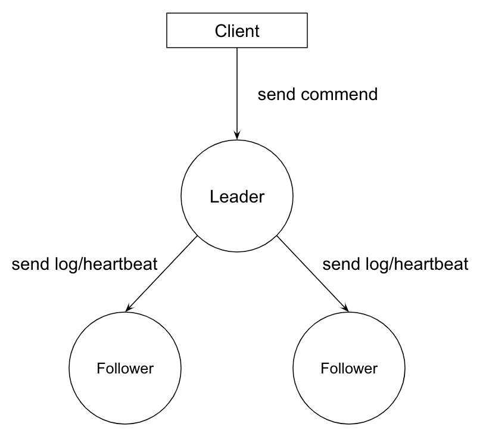
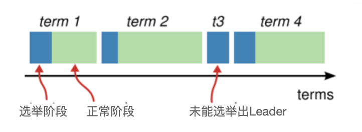
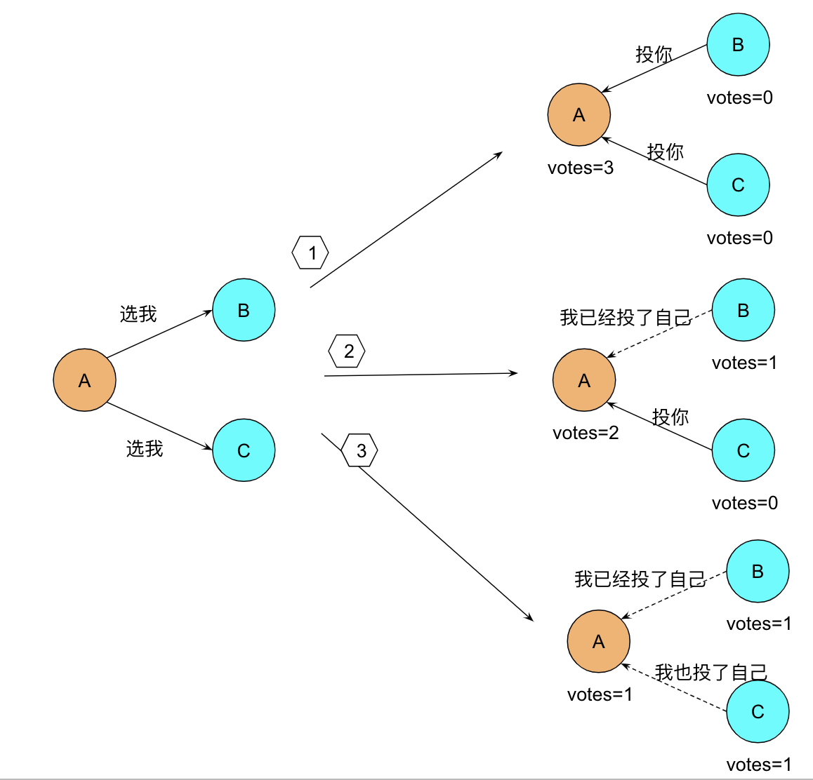
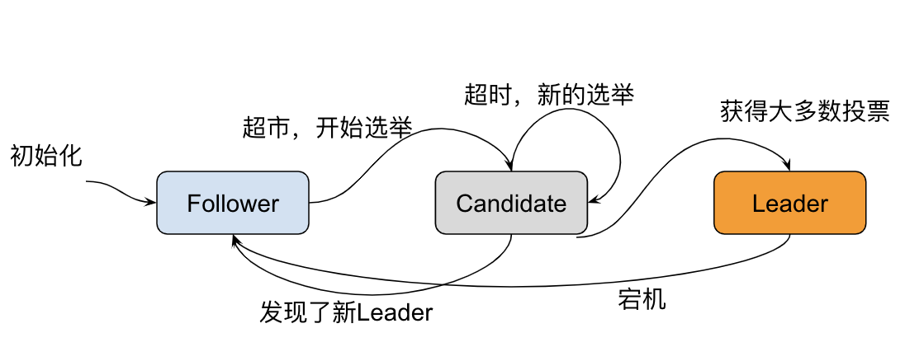
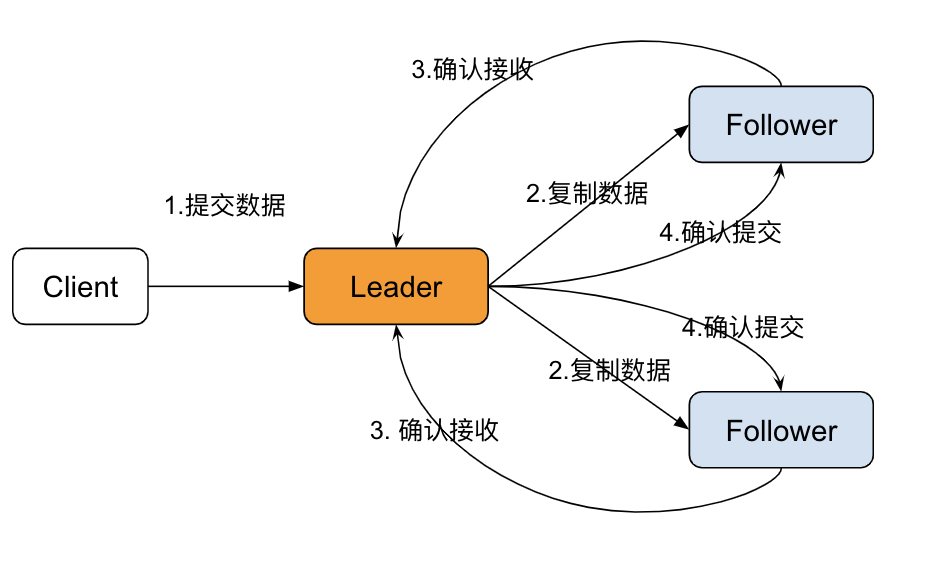

# Raft协议

> Raft是工程上使用较为广泛的强一致性、去中心化、高可用的分布式共识算法。Raft从问世就开始备受关注，被认为是所有共识算法中的最优解，无论是协商效率还是工程实现，效果都非常出色。

Raft协议是一个用于管理复制日志的一致性协议，它提供了一种有效的方法来管理分布式系统中的一致性。Raft协议的主要目标是提供易于理解和实现的一致性算法

## 适用场景

Raft协议主要适用于以下场景：

- 分布式系统：在分布式系统中，多个节点需要保持状态一致性，Raft协议就是为了解决这个问题而设计的
- 容错系统：在需要高可用性的系统中，Raft协议可以处理节点故障，并保持系统正常运行
- 数据库和存储系统：在数据库和存储系统中，数据的一致性是非常重要的，Raft协议可以帮助实现这一点

## 基本概念

Raft 将系统中的角色分为领导者（Leader）、跟从者（Follower）和候选者（Candidate）

- **Leader**：接受客户端请求，并向 Follower 同步请求日志，当日志同步到大多数节点上后高速Follower提交日志
- **Follower**：接受并持久化 Leader 同步的日志，在 Leader 告知日志可以提交后，提交日志。当 Leader 出现故障时，主动推荐自己为候选人
- **Candidate**：Leader 选举过程中的临时角色。向其他节点发送请求投票信息，如果获得大多数选票，则晋升为 Leader

Raft算法将分布式一致性分解为多个子问题，包括Leader选举（Leader election）、日志复制（Log replication）、安全性（Safety）、日志压缩（Log compaction）等

Raft算法将时间划分为不定长度的任期Terms，Terms为连续的数字。每个Term以选举开始，如果选举成功，则由当前leader负责出块，如果选举失败，并没有选举出新的单一Leader，则会开启新的Term，重新开始选举。

### Leader 选举

Raft使用心跳机制来触发领导者选举，当服务器启动时，初始化都是Follower身份，由于没有Leader，Followers无法与 Leader 保持心跳，因此Followers会认为Leader已经下线，进而转为Candidate状态，然后Candidate向集群其他节点请求投票，同意自己成为Leader，如果 Candidate收到超过半数节点的投票(N/2 +1)，它将获胜成为Leader。

Leader 向所有 Follower 周期性发送 heartbeat，如果 Follower 在选举超时时间内没有收到 Leader 的 heartbeat，就会等待一段随机的时间后发起一次 Leader 选举。

### 日志同步

Raft算法实现日志同步的具体过程如下：

- Leader收到来自客户端的请求，将之封装成log entry并追加到自己的日志中；
- Leader并行地向系统中所有节点发送日志复制消息；
- 接收到消息的节点确认消息没有问题，则将log entry追加到自己的日志中，并向Leader返回ACK表示接收成功；
- Leader若在随机超时时间内收到大多数节点的ACK,则将该log entry应用到状态机并向客户端返回成功。

## 优缺点

### 优点

1. **易于理解**：Raft协议的设计目标之一就是易于理解，它的算法和实现都比较简洁。
2. **强一致性**：Raft协议可以确保分布式系统中所有的节点状态保持一致。
3. **容错性**：Raft协议可以处理节点故障，即使有部分节点出现故障，也可以保持系统的正常运行。

### 缺点

1. **性能**：Raft协议需要多个节点进行通信，可能会引起一定的性能损失。
2. **复杂的网络环境**：在网络分区或者严重的网络延迟的情况下，Raft协议可能会出现问题。

## 协议内容

Raft协议主要包括以下几个部分：

1. **领导人选举**：节点可以成为候选人，并发起选举。如果候选人得到大多数节点的投票，那么它就会成为领导人。
2. **日志复制**：领导人负责管理复制日志。当有新的日志条目时，领导人会将其复制到其他节点。
3. **安全**：Raft协议包含一些机制来确保一致性和安全。例如，领导人只会从最新的快照开始复制日志，以防止旧的或者损坏的日志条目被复制。

## 一致性模型

- 线性一致性
- 顺序一致性
- 因果一致性

NWR:

- N个节点保存了冗余的数据
- 写W个节点，剩余N-W是异步地同步数据
- 读R个节点
  
W+R>N 就能保证强一致性

## 对比其他协议

| 特性       | Paxos                        | Raft                                 | Zab                           |
| ---------- | ---------------------------- | ------------------------------------ | ----------------------------- |
| 一致性模型 | 强一致性模型                 | 强一致性模型                         | 强一致性模型                  |
| 领导者选举 | 手动进行领导者选举           | 通过随机超时和心跳信息进行领导者选举 | 通过事务ID进行领导者选举      |
| 状态机复制 | 通过多个阶段的投票来达成一致 | 通过Leader复制少日志来达成一致       | 通过Leader 复制日志来达成一致 |
| 可扩展性   |                              |                                      |                               |
| 简单性     | 需要多阶段投票 , 实现复杂    | 相对简单                             | 相对简单                      |
| 可读性     |                              |                                      |                               |
| cap模型    |                              | AP(Availiable-based)                                      | CP(Consistency-based)         |

总的来说，Raft协议的主要优势在于其易于理解和实现，这使得它在分布式系统中得到了广泛的应用
