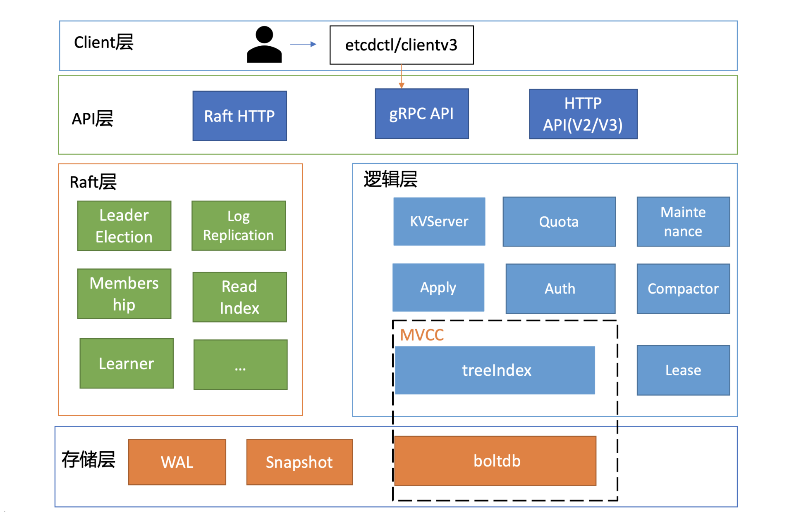

# etcd简介

etcd是一个开源的、分布式的、一致性的键值存储系统，主要用于共享配置和服务发现。它是由CoreOS开发并维护，并且是Kubernetes的重要组成部分。

## etcd的特性

- **一致性和高可用性**：etcd使用Raft一致性算法保证了数据一致性，能够在网络分区或者机器故障时保持系统的可用性。
- **简单的API**：etcd提供了HTTP/JSON API，可以方便地与各种语言和环境进行交互。
- **安全**：etcd支持SSL/TLS通讯，可以为客户端和服务器之间的通讯提供安全保障。
- **观察者模式**：etcd支持观察者模式，允许在键值变化时发送HTTP通知。
- **TTL键值存储**：etcd支持TTL（Time to Live）键值存储，可以设置键值的生命周期。

## etcd的适用场景

etcd常用于以下几种场景：

- **服务发现和注册**：etcd可以作为服务注册和发现的中心，服务可以在etcd中注册自己的信息，客户端可以查询etcd来发现服务。
- **配置管理**：etcd可以用来存储系统配置，当配置发生变化时，可以自动通知到各个服务。
- **分布式锁**：etcd可以实现分布式锁，解决分布式环境下的资源争用问题。
- **领导选举**：在分布式环境中，etcd可以用来进行领导选举。

## etcd 技术原理

etcd 基于map和interval tree(区间树)，实现了watcher 和事件的快速匹配，保障了大规模场景下的watcher机制性能与读写稳定性性能

- Client层: 提供简洁易用的API，同时支持负载均衡、节点间故障自动转移
- API网络层: 包括Client访问server和server节点之间的通信协议, v2 API使用HTTP/1.x协议, V3 API使用gRPC协议
- Raft算法层: Raft算法层实现了Leader选举、日志复制、ReadIndex等核心算法，用于保证etcd多个节点间的数据一致性、提升服务可用性等
- 功能逻辑层: etcd核心特性实现层、如KVServer、MVCC模块、Auth鉴权模块、Lease租约模块、Compactor压缩模块等
- 

## etcd的优缺点

### 优点

- **一致性**：etcd使用Raft算法确保数据一致性，强一致性是etcd的一个重要优势。
- **高可用性**：etcd可以在网络分区或机器故障时保持系统的可用性。
- **安全性**：etcd支持SSL/TLS通讯。

### 缺点

- **性能**：由于etcd保证了强一致性，因此在性能上可能不如一些只保证最终一致性的系统。
- **复杂性**：etcd的一些高级特性可能需要更多的学习和理解成本。

## etcd的技术原理

etcd使用Raft一致性算法来保证数据的一致性。Raft是一个为了实现分布式系统的一致性而设计的算法。它是由Diego Ongaro和John Ousterhout在2013年提出的。Raft算法将一致性问题分解为几个相对独立的子问题，使得算法更易于理解和实现。

在etcd中，一个Raft集群由多个节点组成，其中一个节点作为领导者（leader），其余的节点作为追随者（follower）。领导者负责处理所有客户端的请求，追随者只需复制领导者的日志。当领导者失效时，追随者之间会进行选举产生新的领导者。

## etcd选型对比

| 维度       | Zookeeper                       | etcd                            | Consul                      |
| ---------- | ------------------------------- | ------------------------------- | --------------------------- |
| 数据模型   | 目录结构                        | 键值对                          | 键值对,多类型               |
| 一致性模型 | ZAB(zookeeper atomic broadcast) | raft                            | serf协议 raft               |
| 通知机制   | watch                           | 多类型watch(prefix/range watch) | blocking query              |
| 性能       | 一般                            | 较好                            | 较好                        |
| 可用性     | 非常高                          | 非常高                          | 非常高                      |
| API设计    | 较复杂                          | 轻量级API， 较简单              | 全面，支持http、dns、grpc等 |
| 权限校验   | 实现的ACL                       | 实现了RBAC                      |                             |
| 设计       | 较复杂                          | 轻量级API， 较简单              | 全面，支持http、dns、grpc等 |
| 适用场景   | 强一致性的分布式系统            | 强一致性和高可用的分布式系统    | 服务发现、配置管理等场景    |

## 总结

总的来说，etcd是一个非常强大的分布式协调组件，它提供了一致性和高可用性的键值存储功能，适用于各种分布式场景。但与此同时，etcd也有其缺点，例如性能可能不如一些只保证最终一致性的系统，以及一些高级特性可能需要更多的学习和理解成本。比较其他同类组件，etcd、ZooKeeper和Consul各有其优势和特点，选择哪一个取决于具体的应用场景和需求。
