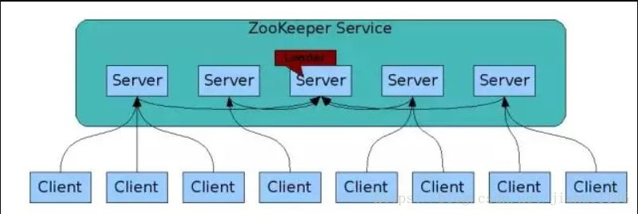

# zookeeper

> 为分布式应用提供分布式的协同服务。

zk提供了一组原语，分布式系统可以根据这组原语构建更高级别的服务：比如同步、配置维护、组和命名。

## 适用的场景

- 统一配置：把配置放在ZooKeeper的节点中维护，当配置变更时，客户端可以收到变更的通知，并应用最新的配置。
- 集群管理：集群中的节点，创建ephemeral的节点，一旦断开连接，ephemeral的节点会消失，其它的集群机器可以收到消息。
- 分布式锁：多个客户端发起节点创建操作，只有一个客户端创建成功，从而获得锁。

构建正确的协同服务非常的困难，特别是那些资源竞争、死锁等情况，通过zk，分布式系统不需要从新开始构建协同服务。

## 特性

操作原语:

- create
- delete
- exists
- get data
- set data
- get chiledren
- sync

特性:

- 顺序一致性：客户端的操作会被按照顺序执行
- 原子性：操作要不失败要不成功
- 可靠性：一旦写入成功，数据就会被保持，直到下次覆盖。
- 顺序一致性：不管连接到zk集群的那台机器，客户端看到的视图都是一致的。leader并不保证每一条数据被全部follower都commit了才被客户端读到，过程可能会在不同的follower上读取到不一致的数据， 但最终所有节点都commit完成后会一致性
- 高可用性：能避免单点故障

## 技术原理

### 总体架构

zk可单机也可集群部署

- 每个server在内存中存储一份数据，并维护当前服务状态，服务与服务保持通信
- zk启动时，从实例中选举一个leader
- leader提供读写服务，follower提供读服务
- 集群间通过zab（zookeeper atomic broadcast）协议保证数据一致性
- 一个更新操作成功，当且仅当大多数server在内存中成功修改了数据

### 模型抽象

提供一个多层级的节点命名空间（节点称为znode），每个节点都有父节点，类似于文件系统。不同的是节点都可以关联数据。 ZNode大小限制是1M，通常存储配置信息，元数据信息，不建议存储较大的数据

- 如何保证全局有序: 所有的更新都是全局有序的，通过唯一的时间戳（ZXid zookeeper transaction Id），写请求会发给其他的机器并达成一致后，请求才会返回成功
- 节点的分类
  - 有序节点: 子节点自增
  - 临时节点: 会话节点结束或超时后，zookeeper会自动删除该节点
- 监听事件的分类
  - 节点创建
  - 节点的删除
  - 节点的修改
  - 子节点变更
- 是否有锁定后不释放的情况: 不会，zookeeper会监听客户的心跳包判断会话是否失效，如果失效就会从临时节点删除而释放锁
- 抢占中是否有并发问题: 不会， 设置监听器和读文件子节点的操作是原子性的。 保证不会出现其他节点抢占后立即释放，当前节点仍在等待的情况。为了避免惊群效应，子节点只会监听自己前一位的子节点删除消息

| 角色     | 描述                                                                                                      |
| -------- | --------------------------------------------------------------------------------------------------------- |
| leader   | leader负责进行投票的发起和决议，更新系统状态                                                              |
| follower | follower用于接受客户请求并向客户端返回结果，在选主过程中参与投票                                          |
| observer | Observer可以接受客户端连接，但不参与投票过程，只同步leader状态， Observer的目的不是扩展系统，提高读取速度 |

### 数据模型

- Data: ZNode存储的数据信息
- ACL: 记录ZNode的访问权限，即哪些人或者哪些IP可以访问本节点
- Stat: 包含ZNode的各种元数据，比如事务ID、版本号、时间戳、大小等
- Child: 当前节点的子节点引用

### 创建分布式锁

- client创建临时且有序的子节点
- client获取/lock下的子节点列表，判断自己创建的子节点是否为当前子节点列表中序号最小的子节点，如果是则认为获得锁，否则监听/lock的子节点变更消息（监听刚好在自己之前一位的子节点删除消息），获得子节点变更通知后重复此步骤直至获得锁
- 执行业务代码，执行完成后子节点释放锁

### 广播过程

zk常规更新数据，由leader广播到所有的follower

- 客户端写入数据请求到任意follower
- follower把写入数据请求转发到leader
- leader采用二阶段提交方式，先发送propose广播给follower
- follower接到propose信息，写入日志成功后，返回ack消息给leader
- leader接到半数以上ack消息，返回成功给客户端，并且广播commit给follower

## 高性能的原因

内存中维护树状的目录结构，因此每个节点存放的数据上限为1M