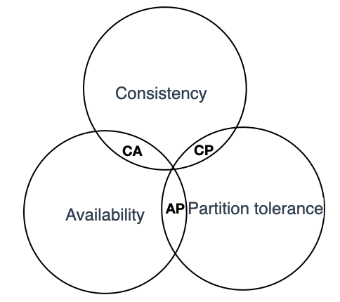

# 分布式理论

## BASE

> 分布式系统中一致性和可用性权衡的结果, 其核心思想是在某些场景中, 无需做到强一致性, 以保证系统的可用性, 同时业务系统可采用适当的方式使数据达到最终一致性

- Basically Available:基本可用, 指分布式系统出现不可预知的故障时, 允许损失系统部分特性来换取系统可用性
  - 响应时间的损失: 当部分节点宕机时, 在请求增加响应时间的基础上返回客户端正常的结果, 而不是停止服务
  - 功能降级: 当处于流量高峰时, 一部分用户请求会返回降级的数据, 而不会真正请求后端的核心数据, 以保证后端系统大部分用户访问的可用性。
- SoftState:软状态, 指允许系统中的数据存在中间状态, 并认为该中间状态的存在不影响整体系统的可用性。即允许系统在不同节点的数据副本之间进行数据同步时存在延时。对比ACID中的原子性, 事务结束之后不会存在残留的中间状态, 而BASE理论的软状态则允许事务出现中间状态。譬如节点之间的投票协商和多副本之间的数据同步都需要进行网络交互, 交互过程中的状态及即是软状态的一种体现
- Eventually Consistent:最终一致性, 强调系统中所有的数据副本, 在经过一段时间同步后, 最终能够达到一个一致的状态。BASE理论允许事务出现中间状态, 但经过一定的时间后, 要求事务结束, 所有的操作要么全部成功、要么全部失败

BASE理论应用与多个微服务之间的调用。微服务的架构中, 一个用户的请求往往需要多个服务配合才能完成, 对于一个强一致性系统的可用性, 都是所依赖服务可用性的乘积, 例如, 在一个事物中, 涉及三个服务的操作, 假设每个服务的可用性为99.9%, 则整个事务的可用性为99.9%*99.9%*99.9%≈99.7%。现代的应用架构中, 通常由几十甚至几百个微服务组成, 对于如何提高整体系统的可用性, 可用BASE理论进行指导, 在允许存在软状态的基础上, 我们只需要保证整个事务的基本可用性和最终一致性即可, 并不需要保证实时一致性, 保障性的设计, 通常采用异步补偿机制

例如一个电商系统中, 下单需要三个服务支持

- 访问支付服务, 通知银行扣款
- 访问库存服务, 扣除购买商品的库存
- 访问积分服务, 为用户增加积分

如果采用异步补偿机制, 则需要明确哪些操作属于非关键操作, 如果非关键操作失败, 允许业务流程继续执行, 然后再异步补偿非关键操作, 以此降低非关键操作失败对整个事务的影响。在上述电商案例中, 我们可以将积分服务定义为非关键操作, 非关键操作失败后, 可以通过定时任务或者消息队列在下单完成后再给用户增加积分。而支付以及库存操作为关键操作, 当其中任意一个发生故障时, 我们都需要回滚本次事务。

采用异步补偿机制需要注意以下几点

- 每个补偿操作都应该设置重试机制, 且需要实现幂等
- 整个事务应由工作流驱动, 记录每个分支操作的处理结果
- 对于所有分支事务, 都需要提供回滚事务的接口

## ACID

> ACID的概念, A、I、D是手段, C（Consistency）是三者协作的目标

事务处理几乎是每一个信息系统中都会涉及到的问题, 它存在的意义就是保证系统中不同数据间不会产生矛盾, 数据修改后的结果是我们期望的, 也就是保证数据状态的一致性（Consistency）, 想要达成数据状态的一致性, 需要三个方面的努力

- 原子性（Atomic）: 在一组操作中, 要么全部操作执行成功, 要么全部执行失败, 不存在中间数据, 也不存在部分操作成功部分操作失败的情况。在执行事务的过程中, 如果某一个操作失败, 那么整个事务都将回滚（Rollback）, 恢复至事务开始的状态
- 隔离性（Isolation）: 多个事务在执行期间, 事务与事务之间互不影响
- 持久性（Durability）: 事务执行成功后, 所有的操作都是永久的, 哪怕服务器发生故障

## CAP

> 分布式系统其一致性（C）、可用性（A）和分区容错性（P）, 最多只能同时满足其中两项

CAP是在ACID的一致性（Consistency, 简写C）, BASE的可用性（Availability, 简写A）两者基础上扩展出了一个新的维度: 即分区容错性（Partitiontolerance, 简写P）, 以此组成CAP定理。通常基于CAP理论, 并结合业务特点进行设计指导, 通过适当取舍最大限度提升整体架构可用性

- 一致性: 被形容为原子性和串行化, 每个读写操作都像是一个原子操作, 并且像全局排好序一样, 后面的读操作一定能读到前面的写操作。这意味着在分布式系统中执行一个操作就像在单节点执行一样
- 可用性: 是指系统提供的服务必须还一直处于可用的状态, 对于用户的每一个操作请求总是能够在有限的时间内返回结果。这里需要注意"有限时间内"和"返回结果"。如果时间处理的延时以及结果匹配性存在异常, 那么我们认为系统是不可用的
- 分区容错性: 分布式的存储系统会有很多的节点, 这些节点都是通过网络进行通信。而网络是不可靠的, 当节点和节点之间的通信出现了问题, 此时就称当前的分布式存储系统出现了分区。分区容错性约束了一个分布式系统需要具有如下特征: 分布式系统在遇到任何网络分区故障时, 仍然需要能够保证对外提供满足一致性和可用性的服务, 除非整个网络环境发生故障

架构设计中不要浪费精力去设计一个满足一致性、可用性、分区容错性三者完美的系统, 而是根据自己业务的特点就行取舍。值得注意的是, CAP中的一致性和可用性表现为强一致性和完全(100%)可用性, 对于一个分布式系统而言, 因为网络必然会出现异常情况, 一旦发生分区错误, 整个分布式系统就完全无法使用, 分区容错性也就成了必然要面对和解决的问题, 因此系统架构师往往需要把精力花在如何根据业务特点在C(一致性)和A（可用性）之间寻求平衡, 而根据一致性和可用性的选择不同, 开源的分布式系统往往又被分为CP系统和AP系统。例如CP系统Zookeeper, 任何时刻对ZooKeeper的访问请求保证能得到一致的数据结果, 而另外的AP系统Eureka, 则保证A, 当分区发生故障时, 保证可用性但无法保证数据一致性
