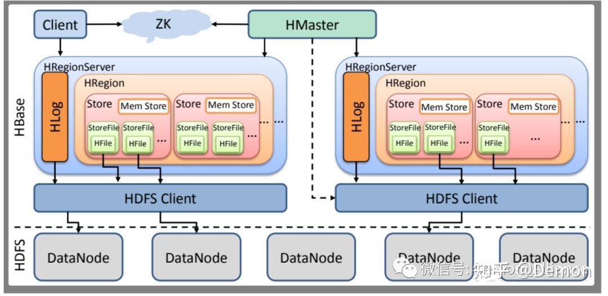
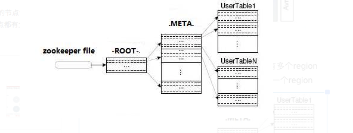

# HBase

> HBase是一个分布式的、面向列的开源数据库，该技术源于Google 论文“Bigtable”，一个结构化数据的分布式存储系统。 HBase在Hadoop至上提供了类似于Bigtable的能力。

## 使用场景

- 不支持事务
- 不支持join操作, there are no joins in HBase you're just more aware of this fact.
- 能扩灵活的水平扩展

## 技术原理

- 适合非结构化松散数据的存储
- 基于列的而不是基于行的模式
- 可以动态的增加列
- 使用LSM存储引擎，写入性能比mysql高了一个数量级，读性能低了一个数量级

HBase有两张特殊的表，ROOT和META

- META: 记录了用户表的Region信息，META可以有多个region
- ROOT: 记录了META表的Region信息, ROOT只有一个region

### HMaster

可以启动多个HMaster，通过Zookeeper避免单点问题

主要功能是负责Table和Region的管理工作

- 管理用户对Table的增、删、改、查操作
- 管理HRegionServer的负载均衡，调整Region分布
- 在Region Split后，负责新Region的分配
- 在HRegionServer停机后，负责失效HRegionServer 上的Regions迁移

### HRegionServer

主要负责响应用户I/O请求, 向HDFS文件系统中读写数据, 是HBase中最核心的模块

以Ephemeral方式注册到Zookeeper中，使得HMaster可以随时感知到各个HRegionServer的健康状态

### HStore

是HBase存储的核心了

组成部分:

- MemStore: Sorted Memory Buffer，用户写入的数据首先会放入MemStore
- StoreFiles: ，当MemStore满了以后会Flush成一个StoreFile（底层实现是HFile）

合并和分裂:

- 合并: 当StoreFile文件数量增长到一定阈值，会触发Compact合并操作，将多个StoreFiles合并成一个StoreFile，合并过程中会进行版本合并和数据删除
- 分裂: 当单个StoreFile大小超过一定阈值后，会触发Split操作，同时把当前Region Split成2个Region，父Region会下线，新Split出的2个Region会被HMaster分配到相应的HRegionServer上

### HLog

- HLog是一个实现Write Ahead Log的类
- 每个HRegionServer中都有一个HLog对象

写入流程:

- 每次操作写入MemStore的同时，也会写一份数据到HLog文件中
- HLog文件定期会滚动出新的，并删除旧的文件（已持久化到StoreFile中的数据）

恢复流程:

- HMaster将其中不同Region的Log数据进行拆分，分别放到相应region的目录下
- 在Load Region的过程中，会Replay HLog中的数据到MemStore中，再然后flush到StoreFiles，完成数据恢复