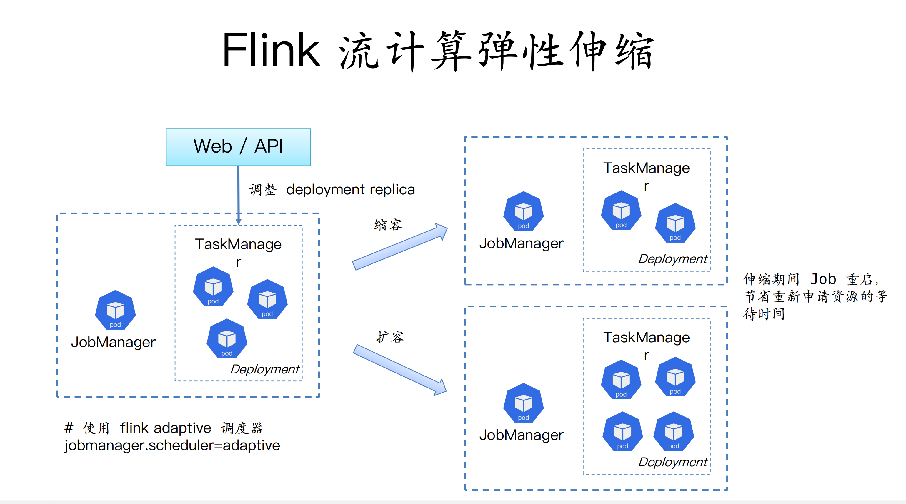
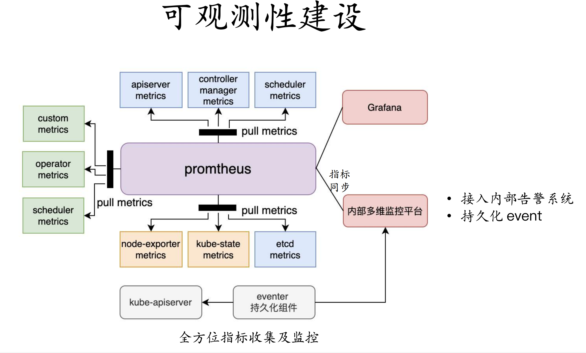

# 云原生大数据

## 选择k8s的原因

- 灵活高效的容器编排、插件扩展能力
- 计算存储分离、互不影响、各自按需弹性扩缩容
- 大数据及AI框架几乎都原生支持，无需侵入式改造，可以灵活适配
- 运维成本低, 应用层无需运维介入

## Native VS Operator

### Native

框架直接与api server交互，控制pod的启停  

- 优点: 根据计算特点实现动态申请资源
- 缺点: 提交端要负责任务生命周期管理、权限管理等

### Operator

自定义crd，声明式接口，由controller管理生命周期, 所有应用（作业）通过Operator声明式API接入

- 优点: 对提交端更友好，只管提交和同步状态
- 缺点: 不能实现动态分配（可以跟native结合使用）

## 调度方式

### Why hostNetwork

- Pod 调度量大，容器网络ip不足
- 容器网络传输效率低

可通过预分配端口，利用k8s pod反亲和调度避免冲突

### 集群环境pod设计

- 大数据及AI多集群环境下Pod设计
  - 稳定性要求高的任务：bigdata独立集群，以DaemonSet方式将辅助agent部署到每个节点，最小化公共组件的成本，最大化机器资源利用
  - 混部集群/算力GPU集群：业务和agents以多容器方式运行在同一个pod，业务之间尽可能完全隔离，充分利用机器空闲资源
- 使用initContainer解耦平台和业务:
  - 大数据类: Spark、Flink用户只需要提供业务Jar包即可，运行环境平台统一提供
  - AI类: 运行环境千变万化，平台只提供公共能力，核心运行环境由用户提供
- 使用flink adaptive 调度器，实现flink的弹性伸缩
- ETCD核心数据分离
- Operator限流, 弹性配额

### 云原生可观测性

