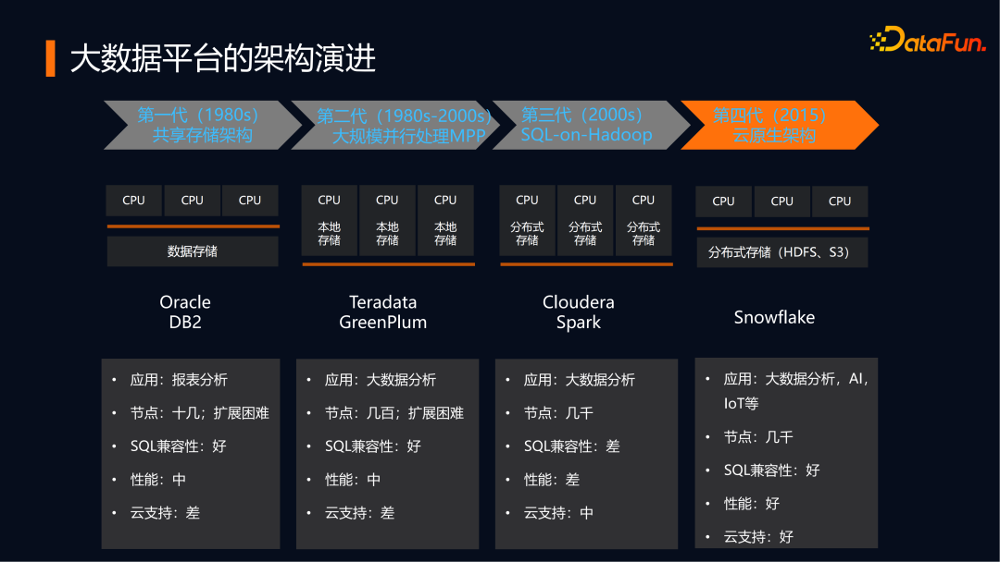
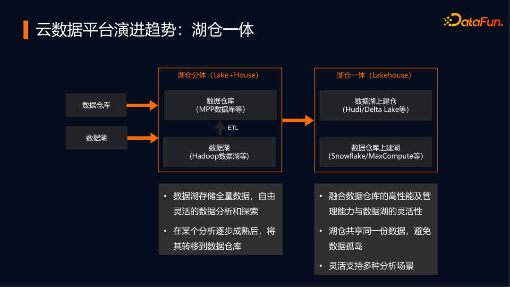
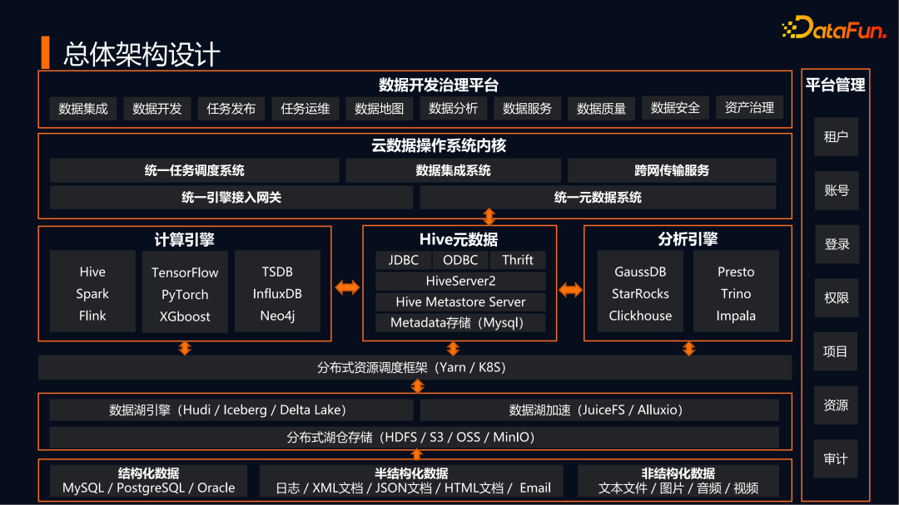
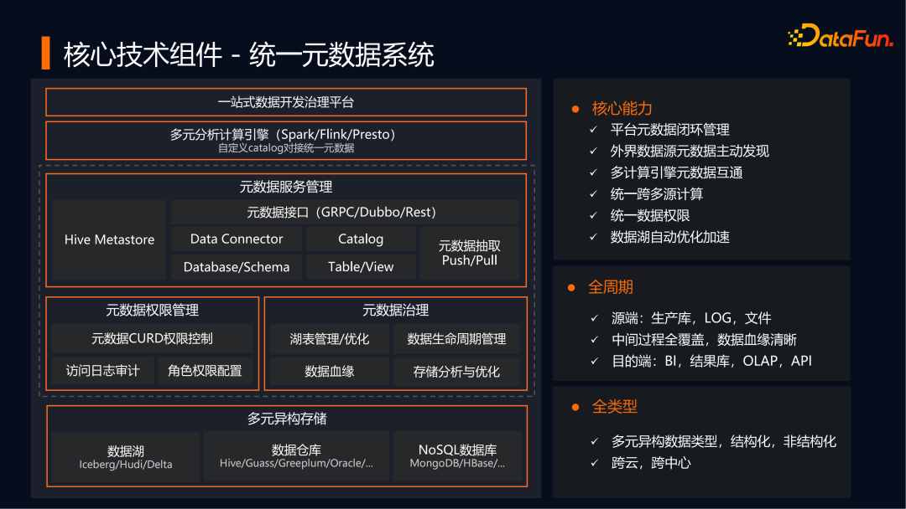
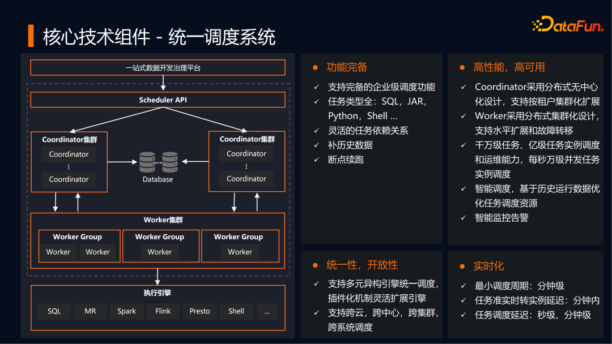
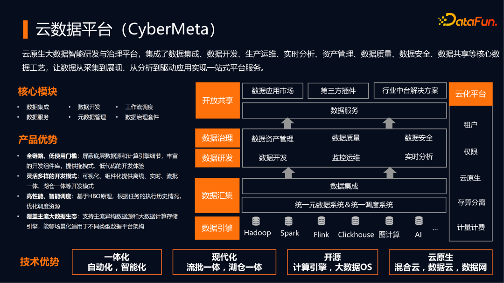

# 云原生大数据

## 技术架构演进

- 共享存储架构: Oracle/DB2, 以共享存储的架构为代表(share storage)，支持的节点很少，扩展困难，只能支撑报表分析的场景为主
- 大规模并行处理: Teradata/GreenPlum, 以大规模并行处理MPP架构为代表(share nothing), 节点规模能够达到百级
- SQL-ON-Hadoop: Cloudera/Spark, 以Hadoop、Spark为代表，基于分布式存储、分布式资源调度,获得了更大规模的集群规模及数据处理规模
- 云原生架构: Snowflake, 基于统一的分布式存储，数据仓库、数据湖技术，支持多种计算引擎，从而满足更多分析场景的需求

## 技术趋势

- 多源引擎
  - 存储引擎: 云上存储S3、OSS等, 非结构化存储需求广泛
  - 流批计算引擎: Spark擅长高吞吐的计算、以及机器学习、图计算等场景；Flink擅长实时性要求高、流批一体等场景
  - 实时分析引擎: MPP查询引擎，MPP数据库
- 实时化与流批一体
  - Lambda架构: 提供流处理和批处理两条链路，为了满足下游的即席查询，批处理和流处理的结果会进行合并，适用于已有完备的离线数仓平台，实时计算较少的场景
  - Kappa架构: 通过改进流计算系统来解决数据全量处理的问题，使得实时计算和批处理过程使用同一套代码，优势在于统一了流批数据逻辑，受限于处理性能。适用于以实时计算为主，全量数据吞吐可控的场景
- 湖仓一体
  - 在数据仓库上支持数据湖（左右结构）: 在数仓中建外部表来实现，以数仓为核心，支持访问数据湖。代表厂商有Snowflake等
  - 在数据湖支持数据仓库(上下结构): 以数据湖存储为基础，在数据湖上构建数据仓库的服务层，强化数据治理和数据服务的提供，代表厂商是Databricks等
- 云原生、存算分离: 存算资源很难进行合理分配
  - 基于Hadoop的存算分离架构: 将Yarn集群和HDFS集群分别部署两个集群，从而实现存储和资源管理的解耦, 适合私有云为主的场景
  - 云原生存算分离: 资源弹性化、数据云上化。存储集群、资源调度、计算引擎是高度解耦的，底层存储可以是HDFS，也可以是S3协议实现等，资源调度完全拥抱k8s，计算引擎可以支持多种主流引擎
- 多云、混合云、数据云
  - 数据中心同时在公有云、私有云部署越来越成为常态，需要有机制进行安全保障。 例如隐私计算技术用于解决不同企业之间的数据安全流动

## 总体架构

- 数据源: 结构化数据、半结构化数据
- 湖仓存储引擎: 统一存储能力、包括对象存储和hdfs，支持数据仓库、数据湖主流存储格式
- 资源调度框架: k8s和yarn，同时支持存算耦合、存算分离架构、覆盖传统大数据集群资源调度、云原生弹性资源调度场景
- 计算分析引擎: 支持 Hive/Flink/Spark 等流批引擎、TensorFlow 等机器学习引擎、TSDB/Neo4j 等专用计算引擎；支持 GaussDB/StarRocks 等 MPP 分析引擎、Presto/Impala 等联邦查询引擎；
- 云数据操作系统内核: 提供通用的技术服务组件，衔接底层大数据引擎和上层数据开发治理平台
  - 统一元数据系统: 存储云数据/计算元数据, 元数据服务管理、元数据权限管理、元数据治理
  - 统一引擎接入网关:
  - 统一任务调度系统: Coordinator(调度器), Worker(执行器)
  - 数据集成系统: 实现异构数据源之间的高速集成, 支持批量同步、流式同步、增量同步
  - 跨网传输服务: 安全传输，可信计算
- 数据开发治理平台: 围绕数据的采集、开发、运维、管理、服务、质量安全等全生命周期，提供一站式全链路的数据开发和服务平台
- 平台管理: 包括租户、账号、权限、项目资源等基础能力，通常由一个多租户组件来承载实现
- 安全管理:
  - OpenLDAP+Kerberos+Ranger: 支持存储的安全认证和管控;
  - 基于统一的元数据服务: 管理分布在混合云上的不同数据中心的元数据信息，并做好数据权限管理;
  - 敏感数据做好数据加密、数据脱敏等安全加固，完成处理后做好计算结果的保护
  - 四是在跨网传输时做好数据安全传输。

云数据服务使用场景

- 基于元数据查看库表信息、UDF信息
- 基于元数据提供数据资产目录、数据地图、数据治理等
- 通过元数据系统探查到上游表发生了变化

## 参考架构

## 核心决策与设计

### 选择k8s的原因

- 灵活高效的容器编排、插件扩展能力
- 计算存储分离、互不影响、各自按需弹性扩缩容
- 大数据及AI框架几乎都原生支持，无需侵入式改造，可以灵活适配
- 运维成本低, 应用层无需运维介入

### Native VS Operator

#### Native

框架直接与api server交互，控制pod的启停  

- 优点: 根据计算特点实现动态申请资源
- 缺点: 提交端要负责任务生命周期管理、权限管理等

#### Operator

自定义crd，声明式接口，由controller管理生命周期, 所有应用（作业）通过Operator声明式API接入

- 优点: 对提交端更友好，只管提交和同步状态
- 缺点: 不能实现动态分配（可以跟native结合使用）

### 调度方式

#### Why hostNetwork

- Pod 调度量大，容器网络ip不足
- 容器网络传输效率低

可通过预分配端口，利用k8s pod反亲和调度避免冲突

#### 集群环境pod设计

- 大数据及AI多集群环境下Pod设计
  - 稳定性要求高的任务：bigdata独立集群，以DaemonSet方式将辅助agent部署到每个节点，最小化公共组件的成本，最大化机器资源利用
  - 混部集群/算力GPU集群：业务和agents以多容器方式运行在同一个pod，业务之间尽可能完全隔离，充分利用机器空闲资源
- 使用initContainer解耦平台和业务:
  - 大数据类: Spark、Flink用户只需要提供业务Jar包即可，运行环境平台统一提供
  - AI类: 运行环境千变万化，平台只提供公共能力，核心运行环境由用户提供
- 使用flink adaptive 调度器，实现flink的弹性伸缩
- ETCD核心数据分离
- Operator限流, 弹性配额

### 云原生可观测性

