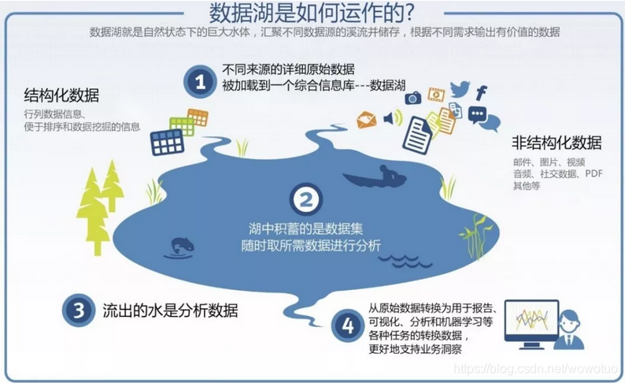

# 数据湖

## 技术趋势

- 数据仓库往数据湖方向发展
- 批处理往流式处理发展
- 本地部署往云模式发展

## 定义

- 数据湖是统一存储池, 可对接多种数据输入方式, 可以存储任意规模的结构化、半结构化、非结构化数据
- 数据湖可无缝对接多种计算分析平台, 直接进行数据处理与分析, 打破孤岛, 洞察业务价值
- 数据湖提供冷热分层转换能力, 覆盖数据全生命周期

数据湖与数据库、数据仓库一样, 都是一种对数据组织方式的描述

### 特点

- 支持多种计算引擎、同时支持流批处理
- 支持多种存储引擎
- 支持数据更新
- 支持事务（ACID）
- 可扩展的元数据
- 数据质量保障

### 对比

| 特性     | 数据仓库                                           | 数据湖                                                              |
| -------- | -------------------------------------------------- | ------------------------------------------------------------------- |
| 数据     | 来自事务系统, 运营数据库和业务线应用程序的关系数据 | 来自IoT设备、网站、移动应用程序、社交媒体和企业应用程序的非关系数据 |
| schema   | 设计在数据仓库实施之前(写入型schema)               | 写入在分析时(读取型schema)                                          |
| 性价比   | 更快的查询会带来较高的存储成本                     | 更快查询结果只需要较低存储成本                                      |
| 数据质量 | 可作为重要事实依据的高度监管数据                   | 任何可以或无法进行监管的数据                                        |
| 用户     | 业务分析师                                         | 数据科学家、数据开发人员和业务分析师                                |
| 分析     | 批处理报告、BI和可视化                             | 机器学习、预测分析、数据发现和分析                                  |

## 方案介绍

数据湖三剑客:

- Delta Lake:
- Hudi:
- iceberg

### Delta Lake

> Delta Lake is an open-source storage layer that brings ACID transactions to Apache Spark™ and big data workloads.

Delta Lake是Spark计算框架和存储系统之间带有Schema信息的存储中间层, DeltaLake是与Spark 强耦合的

- 基于HDFS存储的元数据系统, 解决metastore不堪重负的问题
- 支持更多种类的更新模式, 比如Merge/Update/Delete等操作, 配合流式写入或者读取的支持, 让实时数据湖变得可行
- 流批操作可以共享同一张表
- 版本概念, 可以随时回溯, 避免一次误操作或者代码逻辑而无法恢复的灾难性后果
- 支持多并发写入, 并提供ACID事务保证
- 使用乐观锁控制并发, 适合数据湖这种冲突不经常发生的场景

### Hudi

> Hudi ingests & manages storage of large analytical datasets over DFS (hdfs or cloud stores).

Hudi支持Spark与Flink, 并两种原语

- Update/Delete: 使用细粒度的文件/记录级别索引来支持Update/Delete记录, 同时还提供写操作的事务保证。查询会处理最后一个提交的快照, 并基于此输出结果
- 变更时间轴: 对获取数据变更提供了一流的支持, 可以从给定的时间点获取给定表中已updated/inserted/deleted的所有记录的增量流, 并解锁新的查询类别

### Iceberg

> Iceberg is an open table format for huge analytic datasets

实现了通用的数据组织格式, 利用此格式可以方便地与不同计算引擎对接

- 本质上是一种专为海量分析设计的表格式标准, 可为主流计算引擎提供高性能的读写和元数据管理能力
- table format是Hadoop中的 Metastore 所扮演的角色。功能包含表schema定义、表中文件的组织形式、表相关统计信息、索引信息以及表的读写API实现

Iceberg相对于Metastore的优势

- partition模式: 分区作为一个字段存储而不是文件夹, 避免了查询时多次调用namenode的list方法, 降低namenode 压力, 提升查询性能
- metadata模式: 文件级别列统计信息可以用来根据where字段进行文件过滤, 很多场景下可以大大减少扫描文件数, 提升查询性能
- 新API模式: 实现存储批流一体

特点:

- 支持ACID语义: 基于snapshot快照保证了表的ACID语义, 同时可以实现增量拉取实现
- 延迟较大: 将流数据转换为微批（minibatch）进行处理, 所以实时性会比真正的流式计算差些,延迟可能达到分钟级

## 适用场景

- Lambda数仓架构: 建设的实时数仓存在较多的问题
  - 对账困难: 实时链路和离线链路处理结果经常对不上
  - Kafka无法存储海量数据: 无法基于当前的OLAP分析引擎高效查询Kafka的数据
  - 维护成本高: 代码、数据血缘、schema等都需要两套，运维、监控等成本都很高
- Kappa数仓架构: Flink实现计算引擎层面的流批一体, Iceberg实现存储层面的流批一体
  - 计算+存储两个层面实现流批统一
  - 极大地降低实时数仓的开发和维护成本

- 构建流批一体的实时数仓: 将目前实时数仓常用的Lambda改造为Kappa架构, 解决实时数仓的诸多问题
- 提升ETL任务的执行性能: 以Iceberg为例, 新Partition模式下不再需要请求NameNode的分区信息, 同时得益于文件级别统计信息模式下可以过滤很多不满足条件的数据文件, 可以大大提升ETL任务执行的效率