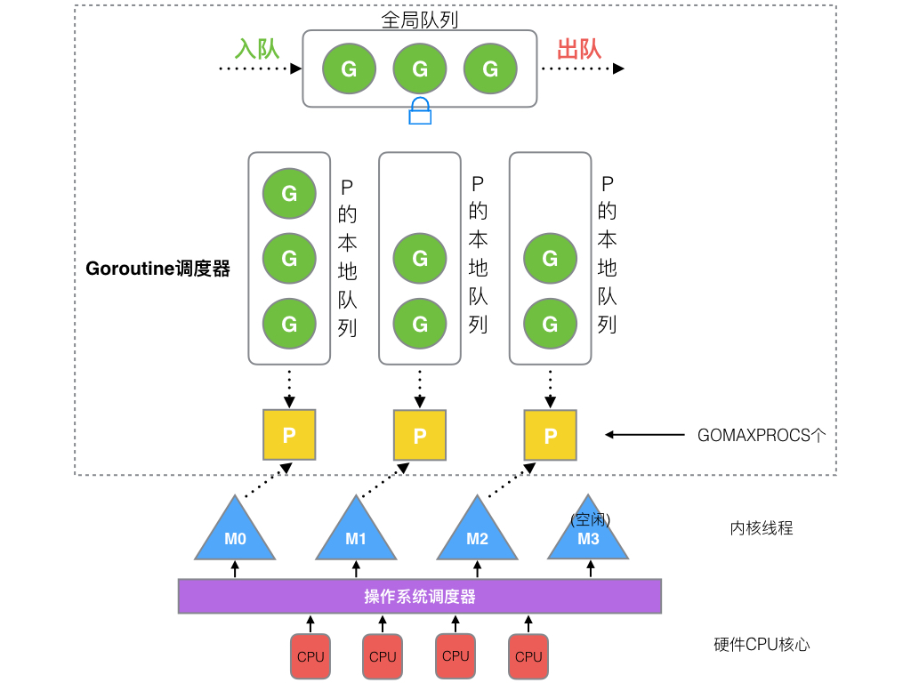

# Golang

- G: goroutine协程, 拥有运行函数的指针、栈、上下文(指的是sp、bp等寄存器上下文以及垃圾回收的标记上下文), 在整个程序运行过程中可以有无数个
- P: processor, 调度逻辑处理器, 也是go中代表资源的分配主题（内存资源、协程队列等），默认为机器核数，可以通过GOMAXPROCS环境变量调整
- M: thread线程, 代表实际的工作者、对应操作系统的线程；M数量比P多，但不会太多，最大为1w个

Go的协程调度 VS 操作系统线程调度

- 调度发生地点：Go中协程的调度发生在runtime，属于用户态，不涉及与内核态的切换；一个协程可以被切换到多个线程执行
- 上下文切换速度：协程的切换速度远快于线程，不需要经过内核与用户态切换，同时需要保存的状态和寄存器非常少；线程切换速度为1-2微秒，协程切换速度为0.2微秒左右
- 调度策略：线程调度大部分都是抢占式调度，操作系统通过发出中断信号强制线程切换上下文；Go的协程基本是主动和被动式调度，调度时机可预期
- 栈大小：线程栈一般是2MB，而且运行时不能更改大小；Go的协程栈只有2kb，而且可以动态扩容（64位机最大为1G）