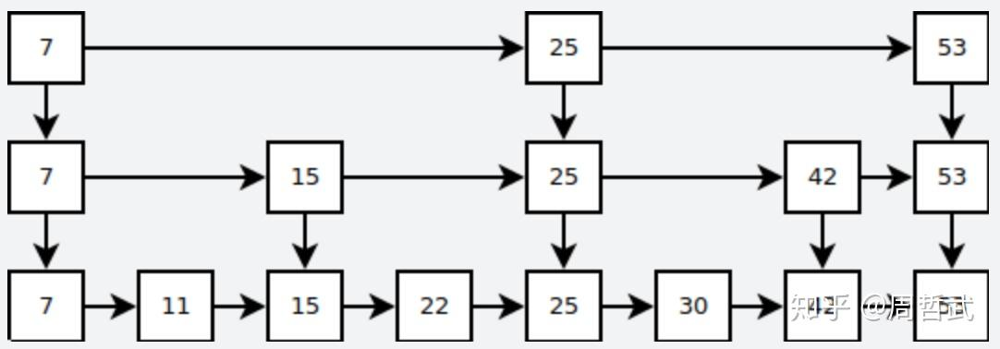

# LevelDB

## 原理

- LSM树（Log Structrured-Merge Tree)实现。核心思想上放弃部分读的性能，换取最大的写入能力。写性能极高，简单地说就是尽量减少随机写的次数。 不是将写直接到磁盘，而是通过1）一次日志文件的顺序写，2）一次内存中的数据插入，极高的写性能
- 顺序写，批量读（按block）进行块读取
- 内存数据库，底层是使用跳表实现
优点：实现简单，效率log(n)，平衡树涉及到节点旋转
原理：利用概率平衡，构造一个快速且简单的数据结构

- memtable本质是一个skip table。skip table是平衡树的一种替代结构，其插入和删除是很简单的。相对于平衡树来说，skip table可以避免频繁的树节点调整操作，所以写入效率很高。
- sstable分为data block、filter block、meta Index block、index block、footer
  - data block存放了具体数据
  - meta block用于扩展，目前存放了bloomfilter
  - footer存放该sst元数据
- restart point的目的是在读取sstable内容时，加速查找过程，由于每个Restart point存储的都是完整的key值，因此在sstable中进行数据查找时，可以首先利用restart point的数据进行键值比较
- skip table的核心思想，空间换时间。每个链表增加了向前的指针（即第一个节点有第二个节点和第三个节点的指针。）,提高了查找的效率。相当于给链表建了索引。

### 写入流程

LevelDb主要的静态结构为: log、memtable、immutable memtable、manifest、current、sstable
LevelDb写入一条记录时:

- 先顺序写log，为磁盘操作
- 再写内存中的memtable。
- 当memtable满了后，变为immutable memtable。
- 不断的将immutable刷入磁盘中的sstable，sstable中kv是有序的。
- manifest用来记录每一级的sstable中的范围。由于manifest会随着sstable的改变不断生成新的manifest。因此用current来记录当前是哪一个manifest。
- immutable memtable和memtable是完全一样的，区别是immutable是只可读的。

### 读取流程

- 先读取memtable
- 再读取immutable memtable
- 是在不行去level0中找，再一层层往下找
- 将索引部分加载到内存中并放入Cache中，这样Cache里面就有了SSTable的缓存索引

### 删除流程

删除操作非常简单，插入删除标记，并不真正去删除记录，在compaction时才去做真正的删除操作。

### 重启流程

冷启动加载sstable index， 使用redolog 恢复成memtable, IndexBlock存放索引，全内存

### compaction

compaction是leveldb最为复杂的过程之一，同样也是leveldb的性能瓶颈之一, Compaction起到了平衡读写差异的作用  
bigtable中有三种compaction, 但levelDB只包含其中两种:

- minor compaction: 将immutable memtable导出到SSTable中, 内存数据持久化到硬盘
- major compaction: 将不同层级的SSTable文件合并, 本质是一个多路归并的过程，
  - 当某个level下的SSTable文件数据超过一定设置值后, levelDb会从这个level的SSTable中选择一个文件，将其和level+1的SSTable文件合并
  - 对于level的层级，选择了了key A, 那么就选择 level+1的文件与A有重叠的所有文件进行合并，生成level+1的文件。 合并完之后，将之前level 和level+1的所有文件删除。
  - 当0层的文件数量超过slowdown Trigger时，写入的速度减慢
  - 当0层的文件数量超过pause Trigger时，写入暂停，直至major compaction完成
- full compaction就是将所有SSTABLE 合并。

## 高性能的原因

LevelDB写性能非常出色，能达到40W+的随机写性能。 达到6W+的随机读性能。

- 通过compaction, 减少文件数量, 提高读性能
- 随机写都是先记录到日志文件中去，在日志文件满之前只是简单的更新memtable，那么就把随机写转化为了顺序写。 
- 在日志满了后，把日志里面的数据排序写成sst表的同时和之前的sst进行合并，这个动作也是顺序读和写。
- 写日志的时候，用到的是buffer IO，也就是，也就是说如果操作系统有足够的内存。 这个读写全部由操作系统缓冲。 传统的磁盘raid 的顺序读写吞吐量很大。100M左右是没有问题。多线程更新的性能非常好。 