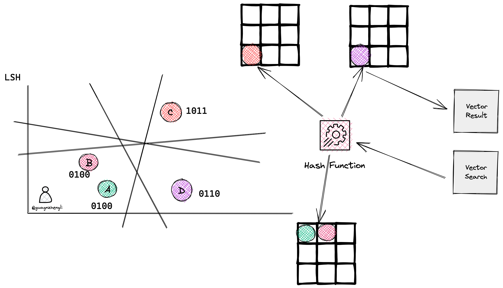

# 向量数据库

## 背景

- 将文档转换成向量
- 将用户问题转换成向量
- 从数据库中搜索最相似的向量, 匹配最相似的上下文
- 将上下文返回给GPT

好处是可以减少GPT的计算量, 从而提高响应速度、降低成本,并绕过GPT的token限制

### GPT的缺陷

- 输入端上下文(tokens)大小的限制, 例如gpt-3.5-turbo模型它的限制是4K tokens
- GPT没有记忆功能的, 所谓的记忆功能只是开发者将对话记录存储在内存或者数据库中,当你发送消息给gpt模型时,程序会自动将最近的几次对话记录, 通过prompt组合成最终的问题, 并发送给 ChatGPT
- Token数量影响响应速度, Claude 给出的例子是GPT处理72K tokens上下文的响应速度是22秒
- GPT API的价格是按照tokens来收费的, 所以输入的上下文越多,其价格越按昂贵

## 核心思想

将文本转换成向量,然后将向量存储在数据库中,当用户输入问题时,将问题转换成向量,然后在数据库中搜索最相似的向量和上下文,最后将文本返回给用户。

### Vector Embeddings

对于传统数据库,搜索功能都是基于不同的索引方式（B Tree、倒排索引等）加上精确匹配和排序算法（BM25、TF-IDF）等实现的。本质还是基于文本的精确匹配,这种索引和搜索算法对于关键字的搜索功能非常合适,但对于语义搜索功能就非常弱。例如,如果你搜索“小狗”,那么你只能得到带有“小狗”关键字相关的结果,而无法得到"柯基"、"金毛"等结果,因为"小狗"和"金毛"是不同的词,传统数据库无法识别它们的语义关系,所以传统的应用需要人为的将“小狗”和“金毛”等词之间打上特征标签进行关联,这样才能实现语义搜索。而如何将生成和挑选特征这个过程,也被称为Feature Engineering(特征工程),它是将原始数据转化成更好的表达问题本质的特征的过程。  
Vector Embedding是由AI模型（例如大型语言模型 LLM）生成的,它会根据不同的算法生成高维度的向量数据,代表着数据的不同特征,这些特征代表了数据的不同维度

### 特征与向量

- 特征向量: 只要特征足够多,就能够将所有的狗区分开来,最后就能得到一个高维的坐标系, 世间万物都可以用一个多维坐标系来表示,它们都在一个高维的特征空间中对应着一个坐标点
- 相似性搜索: 向量是具有大小和方向的数学结构,所以可以将这些特征用向量来表示,这样就能够通过计算向量之间的距离来判断它们的相似度
- 维度灾难问题: 随着维度的增加,数据点之间的距离会呈指数级增长,这也就意味着,在高维坐标系中,需要更多的聚类中心点将数据点分成更小的簇,才能提高分类的质量。否者,向量和自己的聚类中心距离很远,会极大的降低搜索的速度和质量。但如果想要维持分类和搜索质量,就需要维护数量庞大的聚类中心。随之而来会带来另一个问题,那就是聚类中心点的数量会随着维度的增加而指数级增长,这样会导致我们存储码本的数量极速增加,从而极大的增加了内存的消耗

### Similarity Search

搜索算法主要思想: 降维或减少向量值长度, 缩小搜索范围

- HNSW: Hierarchical Navigable Small Worlds
  - 原理: 每次将向量加到数据库中的时候,先找到与它最相邻的向量,然后将它们连接起来,这样就构成了一个图。当需要搜索的时候,就可以从图中的某个节点开始,不断的进行最相邻搜索和最短路径计算,直到找到最相似的向量
  - 优点: 搜索的质量与搜索速度较高
  - 缺点: 内存开销大, 需要存储向量并且维护图, 典型的空间换时间算法
- LSH: Locality Sensitive Hashing
  - 原理: 使用近似最近邻搜索的索引技术, 使用一组哈希函数将相似向量映射到桶中, 当搜索一个向量时,将这个向量再次进行哈希函数计算,得到相同桶中的向量,然后再通过暴力搜索的方式,找到最接近的向量
  - 优点: 快速, 同时仍然提供一个近似、非穷举的结果
  - 缺点: 但是在高维空间中,数据点之间的距离往往非常稀疏,数据点之间的距离会随着维度的增加呈指数级增长。导致计算出来的桶非常多
- RP: Random Projection
  - 原理: 降维, 在多维坐标系中,通过随机生成一个超平面,将多维坐标系划分为两个区域,从而区分相似性。基本思想是使用随机投影矩阵将高维向量投影到低维空间中。创建一个由随机数构成的矩阵,其大小将是所需的目标低维值。然后计算输入向量和矩阵之间的点积,得到一个被投影的矩阵,它比原始向量具有更少的维度但仍保留了它们之间的相似性。
  - 优点: 减少计算时间和提高查询质量

### Similarity Measurement

- 欧几里得距离（Euclidean Distance）
  - 原理: 两个向量之间的距离
  - 优点: 可以反映向量的绝对距离,适用于需要考虑向量长度的相似性计算。例如推荐系统中,需要根据用户的历史行为来推荐相似的商品,这时就需要考虑用户的历史行为的数量,而不仅仅是用户的历史行为的相似度。
- 余弦相似度（Cosine Similarity）
  - 原理: 两个向量之间的夹角余弦值
  - 优点: 对向量的长度不敏感,只关注向量的方向,因此适用于高维向量的相似性计算。例如语义搜索和文档分类
- 点积相似度 (Dot product Similarity)
  - 原理: 两个向量之间的点积值
  - 优点: 简单易懂,计算速度快,并且兼顾了向量的长度和方向。适用于许多实际场景,例如图像识别、语义搜索和文档分类等。
  - 缺点: 对向量的长度敏感,因此在计算高维向量的相似性时可能会出现问题。

### 过滤 (Filtering)

向量数据库通常维护两个索引

- 一个是向量索引
- 另一个是元数据索引

然后,在进行相似性搜索本身之前或之后执行元数据过滤,但无论哪种情况下,都存在导致查询过程变慢的困难。

- Pre-filtering：在向量搜索之前进行元数据过滤。虽然这可以帮助减少搜索空间,但也可能导致系统忽略与元数据筛选标准不匹配的相关结果。
- Post-filtering：在向量搜索完成后进行元数据过滤。这可以确保考虑所有相关结果,在搜索完成后将不相关的结果进行筛选。

为了优化过滤流程,向量数据库使用各种技术,例如利用先进的索引方法来处理元数据或使用并行处理来加速过滤任务。平衡搜索性能和筛选精度之间的权衡对于提供高效且相关的向量数据库查询结果至关重要。

## 选型

| 向量数据库 | URL                                    | GitHub Star | Language      | Cloud |
| ---------- | -------------------------------------- | ----------- | ------------- | ----- |
| chroma     | https://github.com/chroma-core/chroma  | 7.4K        | Python        | ❌     |
| milvus     | https://github.com/milvus-io/milvus    | 21.5K       | Go/Python/C++ | ✅     |
| pinecone   | https://www.pinecone.io/               | ❌           | ❌             | ✅     |
| qdrant     | https://github.com/qdrant/qdrant       | 11.8K       | Rust          | ✅     |
| typesense  | https://github.com/typesense/typesense | 12.9K       | C++           | ❌     |
| weaviate   | https://github.com/weaviate/weaviate   | 6.9K        | Go            | ✅     |

传统数据的扩展

- RediSearch模块扩展向量搜索的功能
- PostgreSQL提供pgvector开启向量搜索的功能。它不仅支持精确和相似性搜索,还支持余弦相似度等相似性测量算法。

## 总结

本文主要介绍了向量数据库的原理和实现,包括向量数据库的基本概念、相似性搜索算法、相似性测量算法、过滤算法和向量数据库的选型等等。向量数据库是崭新的领域,目前大部分向量数据库公司的估值乘着AI和GPT的东风从而飞速的增长,但是在实际的业务场景中,目前向量数据库的应用场景还比较少,抛开浮躁的外衣,向量数据库的应用场景还需要开发者们和业务专家们去挖掘