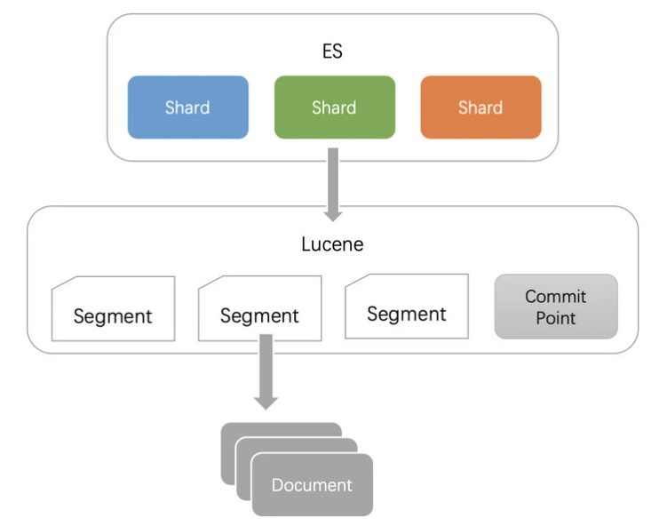
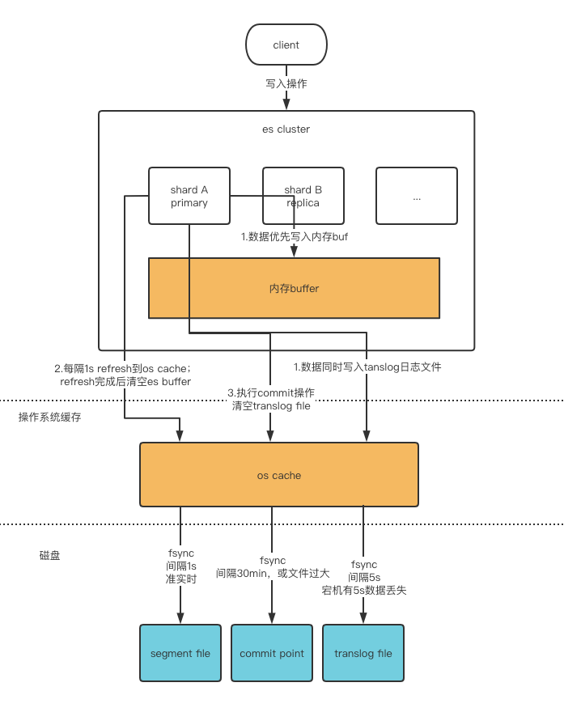
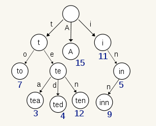
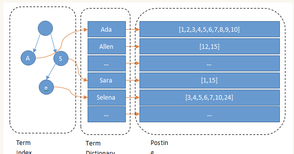

# Elastic Search

> Elasticsearch 是一个分布式可扩展的实时搜索和分析引擎, 一个建立在全文搜索引擎Lucene基础上的搜索引擎。它不仅包括了全文搜索功能,还包括分布式实时文件存储,并将每一个字段都编入索引,使其可以被搜索。可以扩展到上百台服务器,处理PB级别的结构化或非结构化数据。

## 基本概念

| 存储类型       |        |             |         |          |       |
| -------------- | ------ | ----------- | ------- | -------- | ----- |
| 关系数据库     | 数据库 | 表          | 表结构  | 行       | 列    |
| Elastic Search | index  | type(废弃） | mapping | document | field |

一个文档的数据,通常是 json 格式

```shell
{
    "name" :     "John",
    "sex" :      "Male",
    "age" :      25,
    "birthDate": "1990/05/01",
    "about" :    "Hello world",
    "interests": [ "sports", "game" ]
}
```

名词解析

- 集群(cluster):由一个或多个节点组成, 并通过集群名称与其他集群进行区分
- 节点(node):单个 ElasticSearch 实例
- 索引(index):在 ES 中, 索引是一组文档的集合
- 分片(shard):因为 ES 是个分布式的搜索引擎, 所以索引通常都会分解成不同部分, 而这些分布在不同节点的数据就是分片. ES 自动管理和组织分片, 并在必要的时候对分片数据进行再平衡分配, 所以用户基本上不用担心分片的处理细节,一个分片默认最大文档数量是 20 亿.
- 副本(replica):ES 默认为一个索引创建 5 个主分片, 并分别为其创建一个副本分片. 也就是说每个索引都由 5 个主分片成本, 而每个主分片都相应的有一个 copy.

分片及副本的分配是高可用及快速搜索响应的设计核心。主分片与副本都能处理查询请求, 它们的唯一区别在于只有主分片才能处理索引请求。

## 架构



### 分片

每一个shard就是一个Lucene Index,包含多个segment文件,和一个commit point文件。在es配置好索引后,集群运行中是无法调整分片配置的。如果要调整分片数量,只能新建索引对数据进重新索引（reindex）,该操作很耗时,但是不用停机。  
分片时主要考虑数据集的增长趋势,不要做过度分片。

每个分片都有额外成本：

- 每个分片本质上就是一个Lucene索引, 因此会消耗相应的文件句柄, 内存和CPU资源
- 每个搜索请求会调度到索引的每个分片中, 如果分片分散在不同的节点倒是问题不太, 但当分片开始竞争相同的硬件资源时, 性能便会逐步下降
- 每个搜索请求会遍历这个索引下的所有分片
- ES 使用词频统计来计算相关性. 当然这些统计也会分配到各个分片上, 如果在大量分片上只维护了很少的数据, 则将导致最终的文档相关性较差

es 推荐的最大JVM堆空间时30～32G, 所以如果分片最大容量限制为30G, 假如数据量达到200GB, 那么最多分配7个分片就足够了。过早的优化是万恶之源, 过早的分片也是。

### 流程

#### 写入数据

- 客户端选择一个node发送请求过去,这个node就是 coordinating node (协调节点)
- coordinating node对document进行路由,将请求转发给对应的node
- 实际上的node上的primary shard处理请求,然后将数据同步到replica node
- coordinating node如果发现primary node和所有的replica node都搞定之后,就会返回请求到客户端

其中步骤 3 中 primary 直接落盘 IO 效率低,所以参考操作系统的异步落盘机制：


- ES使用了一个内存缓冲区Buffer, 先把要写入的数据放进buffer, 同时将数据写入translog日志文件（其实是些 os cache）。
- refresh: buffer数据满/1s定时器到期会将buffer写入操作系统segment file中,进入cache立马就能搜索到,所以说es是近实时（NRT,near real-time）的
- flush: tanslog超过指定大小/30min定时器到期会触发commit操作将对应的cache刷到磁盘file,commit point写入磁盘,commit point里面包含对应的所有的segment file
- translog默认5s把cache fsync到磁盘,所以es宕机会有最大5s窗口的丢失数据

#### 读取数据

- 客户端发送任何一个请求到任意一个node,成为coordinate node
- coordinate node对document进行路由, 将请求rr轮训转发到对应的node,在primary shard以及所有的replica中随机选择一个, 让读请求负载均衡
- 接受请求的node, 返回document给coordinate note
- coordinate node返回给客户端

#### 搜索过程

- 客户端发送一个请求给coordinate node
- 协调节点将搜索的请求转发给所有的shard 对应的primary shard或replica shard
- query phase: 每一个shard将自己搜索的结果（其实也就是一些唯一标识）, 返回给协调节点, 有协调节点进行数据的合并、排序、分页等操作,产出最后的结果
- fetch phase: 接着由协调节点,根据唯一标识去各个节点进行拉去数据, 最总返回给客户端

#### 索引

> 一切设计都是为了提高搜索的性能

为了提高搜索的性能,难免会牺牲某些其他方面,比如插入/更新,否则其他数据库不用混了。前面看到往Elasticsearch里插入一条记录, 其实就是直接PUT一个json的对象,这个对象有多个fields,比如上面例子中的 name, sex, age, about, interests,那么在插入这些数据到Elasticsearch的同时, Elasticsearch还默默的为这些字段建立索引--倒排索引, 因为 Elasticsearch最核心功能是搜索。

#### 倒排索引

- Term Index: 如果term太多, term Dictionary放内存放不下, Term Index就像字典里的索引页一样
- Term Dictionary: ES为了能快速找到某个Term, 将所有的term排序进行二分查找
- Posting List: 是一个int数组,存储了所有符合某个term的文档id

  
Term Index不需要存所有term,只是一个前缀数,再结合FST压缩技术,存放到内存中。通过TermIndex定位到TermDictionary在磁盘上的block后,在顺序查找磁盘,降低随机读磁盘的次数


压缩技术: Roaring bitmap(RBM),Bitmap的缺点是存储空间随着文档个数线性增长, RBM需要打破这个魔咒就一定要用到某些指数特性：将posting list按照65535为界限分块,比如第一块所包含的文档id范围在0~65535之间,第二块的id范围是 65536~131071, 以此类推。再用<商,余数>的组合表示每一组id, 这样每组里的id范围都在0~65535内了


举个例子:  

- 821697800对应的16进制数为30FA1D08, 其中高 16 位为30FA, 低16位为1D08。
- 我们先用二分查找从一级索引中找到数值为30FA的容器（如果该容器不存在,则新建一个）,从图中我们可以看到,该容器是一个Bitmap 容器。
- 找到了相应的容器后,看一下低16位的数值1D08,它相当于是7432,因此在Bitmap中找到相应的位置,将其置为1即可。

#### 联合索引

- 利用跳表(Skip list)的数据结构快速做“与”运算,或者对最短的posting list中的每个id,逐个在另外两个posting list中查找看是否存在,最后得到交集的结果。
- 利用上面提到的 bitset 按位“与”直接按位与,得到的结果就是最后的交集。

### 总结

将磁盘里的东西尽量搬进内存,减少磁盘随机读取次数(同时也利用磁盘顺序读特性),结合各种奇技淫巧的压缩算法,用及其苛刻的态度使用内存。

注意事项

- 不需要索引的字段,一定要明确定义出来,因为默认是自动建索引的
- 同样的道理,对于 String 类型的字段,不需要 analysis 的也需要明确定义出来,因为默认也是会 analysis 的
- 选择有规律的ID很重要,随机性太大的ID(比如 java 的UUID)不利于查询
- 上面看到的压缩算法,都是对Posting list里的大量ID进行压缩的,那如果ID是顺序的,或者是有公共前缀等具有一定规律性的ID,压缩比会比较高
- 拒绝大聚合
- 拒绝模糊查询
- 拒绝深度分野ES获取数据时,每次默认最多获取10000条,获取更多需要分页,但存在深度分页问题,一定不要使用from/Size方式,建议使用scroll或者searchAfter 方式。scroll会把上一次查询结果缓存一定时间（通过配置scroll=1m实现),所以在使用scroll时一定要保证search结果集不要太大。
- 拒绝多层嵌套,不要超过2层,避免内存泄漏
- 拒绝top>100的查询, top查询是在聚合的基础上再进行排序,如果top太大,cpu的计算量和耗费的内存都会导致查询瓶颈