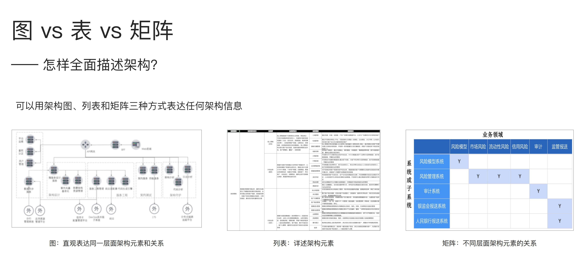

# 架构可视化

## 为什么要架构可视化

- 画清楚是想清楚和说清楚的必要条件
- 可视化是抽象化、严格化、规范化的前提

## 企业级架构

- 企业级的业务架构：解决业务愿景不清、缺乏业务共识
- 企业级的应用架构：系统重复建设、无法对齐业务
- 企业级的数据架构：数据错误、不一致
- 企业级的技术架构：技术栈不统一、基础设施低效

## 企业蓝图

架构治理逻辑，要求准确的架构图，准确不等于陷入细节。准确指在特定抽象层次，特定视角，和系统保持一致性和完整性

## 如何绘制

- 基于UML Profile机制，C4模型可以看做是UML的扩展
- 可以用架构图、列表和矩阵三种方式表达任何架构信息
- 采用浮现式设计，持续迭代和演进
- 绘制原则：价值优先、建立框架和持续演进

## 架构治理工具

- 保存多维度知识
- 自动生成架构图
- 验证架构约束
- 感知实际架构变化
- 实施架构守护
- 版本管理
- 支持协作

