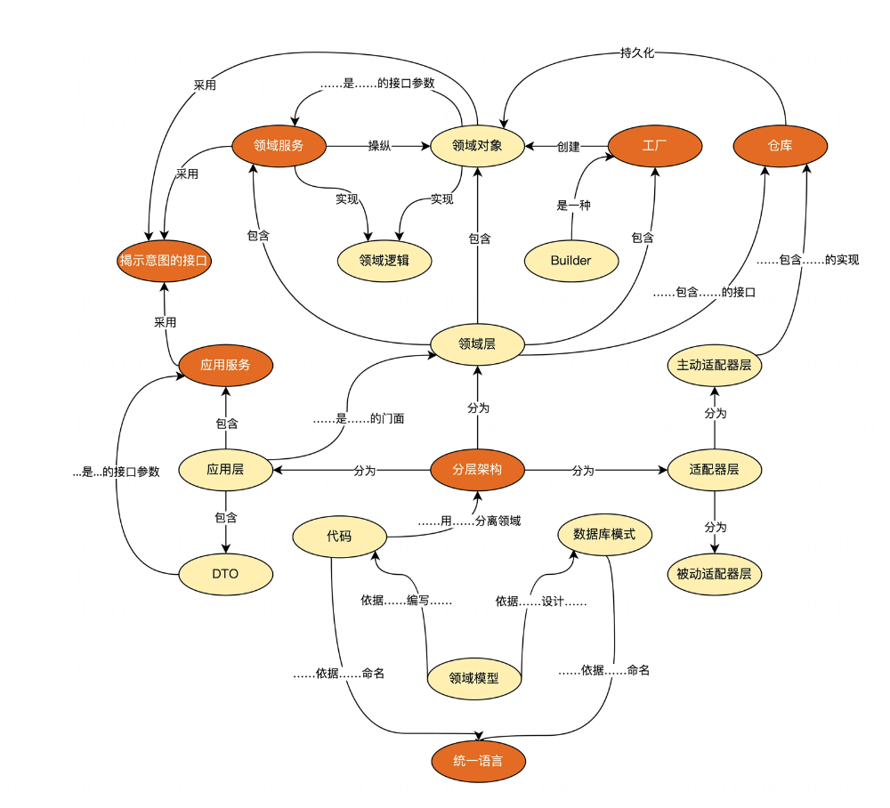
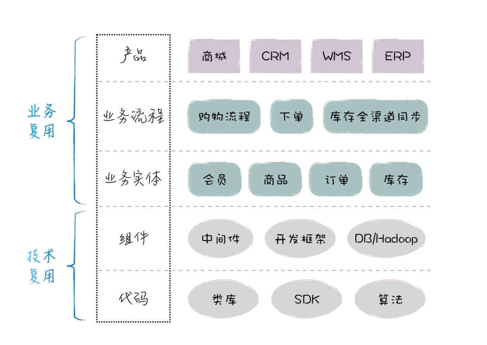

# 领域驱动设计

| 架构演进         | 核心思想                                                                         | 优点                               | 缺点                       |
| ---------------- | -------------------------------------------------------------------------------- | ---------------------------------- | -------------------------- |
| 单体架构         | 快速组织界面交互、业务逻辑和数据之间的关系                                       | 快速成型，管理简单                 | 依赖复杂、单点失效         |
| 分离架构         | 分而治之、按照业务拆分、按照技术拆分（MVC、MVP、MVVM)                            | 业务分层更清晰、组件复用           | 业务依旧耦合               |
| 服务化架构       | 设立业务之间的接口契约                                                           | 业务解耦更内聚                     | 服务数量膨胀               |
| 微内核架构       | 配套插件注册和发现机制，业务动态发布                                             | 服务隔离可插拔，局部失效影响可控   | 管理成本高、调用链路长     |
| 领域驱动设计架构 | 战略设计从业务角度出发，建立业务领域模型, 战术设计从技术视角出发，侧重于技术实现 | 解决复杂业务问题，架构随着业务发展 | 需城市的团队，经验高度抽象 |

## 领域模型

- 失血模型: domain object 只有属性的set/get方法
- 贫血模型: 包含了不依赖于持久化的原子领域逻辑，而组合逻辑在service层
- 充血模型: 绝大多数业务逻辑都应该放在domain object里面，包括持久化逻辑，而service层是很薄的一层，仅仅封装了事务和少量逻辑，不和Dao层打交道
- 胀血模型: 取消了service层，只剩下domain object和dao两层，在domain object上封装了事务

## DDD

需求分析 -> 业务分析 -> 架构设计

- 领域模型要和业务模型一致
- 系统实现要和领域模型一致

建立词汇表、完善业务表、包图和类图等

聚合 -> 值对象 -> 限定 -> 泛华

- 实体：存在唯一性ID，属性值可以变化(Entity)
- 值对象: 全部属性值决定了唯一性，属性值不可以变化。例如状态，时间段、快照等
  - 体现在内存和数据库布局的灵活性上
  - 值对象不变可以带来更高的程序质量

## 微服务

基础服务划分原则

- 服务的完整性：不仅是增删改查的dao，而是完整覆盖的业务领域
- 服务的正交性：基础服务不互相调用，而是通过上层聚合服务去调用各个服务
- 服务的一致性：谁拥有信息，谁就负责提供相应功能

基础服务的核心，是边界的划分和功能的抽象设计

- 数据模型: 主订单由订单服务管理，子状态由应用方进行管理
- 接口设计: 提供不同粒度的接口，粗粒度/中粒度/细粒度分别返回不同的字段

## 微服务实践建议

- 不盲目跟风，选择适合业务和组织的架构。
- 如果涉及业务重构，重构过程一定要遵循方法论  
  - 确保重构面可控，小步慢跑，逐步递推
  - 保证测试用例覆盖率, 测试用例是RD信心来源
  - 确保有一套完整灰度发布方案
  - 随时保证线上改动可降级，确保事故可止损
- 一定要有一套自己的监控体系 
- 对于小微企业，可从自研转向开源二次开发。如果缺少一些RD资源，可以考虑更成熟的商业服务