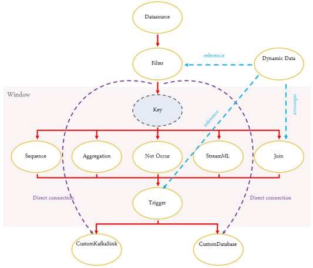

# 关联分析引擎

> 流式分布式关联分析引擎， 是CEP(Complex Event Processing, 复杂事件处理)技术在大数据领域的一个具体体现

## 业务问题

- 实时分析: 时延要求严格，攻防双方抢时间差
- 性能问题: 传统关联引擎往往需要加载几十条规则即达到性能瓶颈，并且需要避免整体性能随规则条数上升而发生线性下降
- 扩展性问题: 需要随着业务规模不断的动态扩展
- 规则的语义扩展问题: 架构需灵活，才能适应未来安全分析场景的各种需求

## 架构设计

选择flink的原因

- 编程接口丰富
- 自带多种window算子
- 支持exactly-once语义
- 高性能分布式检查点
- 流批一体的计算模式

使用EPL语言

### 技术挑战

- 资源硬件受限
- 定制需求多
- 原生flink只提供了函数式编程模式，需要编写符合特定业务需求的代码，不便于支持动态更新规则
- 运行时需要将所有数据传输到CEP算子，由CEP算子串行执行各个条件语句, 汇集到单点的模式，产生了不必要的的网络负载
- 缺少必要算子，例如"不发生"

### 概要设计

规则配置

- datasource
- filter condition
- threshold condition
- rule response

#### 三大核心模块

- 规则配置端: 生成规则文件与策略文件
- server端: 文件解析、生成DAG、词法/语法分析，生成AST树，再将AST树翻译成任务java代码，最后调用maven命令打包java代码为任务jar包，并将任务jar包及基础运行库一并提交到计算集群上
- 运行端: 由kafka从数据源向引擎提供原始日志、处理结果为回注事件和告警事件两类, 执行过程会定时输出节点的运行监控消息到server端

自研了部分核心算子

- 优化filter算子，可同时执行多种业务逻辑，从一个事件输出一个变成输出多个
- 自定义window算子，适合网络安全检测需求
- 自研的Machine Learning算子，输入是事件流、检测对象和对象属性。输出是事件、告警和预警
  - 行为特征异常检测: 长时间统计分析对象建立行为基线
  - 时间序列异常检测: 按时间顺序排列的某个或多个属性数值是否异常
  - 群组聚类分析

- 蓝色为引用动态数据
- 紫色虚线为表示filter无需经过window可直连输出组件

性能优化

- 数据源、动态表引用优化。根据EPL语义等价原则合并相同的数据源，减少数据输入总量及线程总数
- 匹配引擎优化。采用流式状态机引擎，复用状态机缓存的状态，提升匹配速度
- 计算表达式优化。根据EPL中表达式的具体特性，构建最优的计算数据结果，避免全表扫描
- 自定义流式windows算子，采用"时间槽"技术实现乱序纠正功能
- 数据分区自动推导，优化流拓扑。通过对全局窗口hash优化，避免所有全局窗口都分配同一个taskmanager, 提高整体内存利用率

适配优化

- 依赖优化: 业务代码减少对API层的依赖, 依赖最基础的
- 流量控制: 输出端做流量控制，保护下级应用
- 自我保护: 防止oom

#### 图优化器

- 图融合
  - 子图融合
  - 时间窗口归并
  - 公共资源优化
  - 图节点语义融合
- 数据流优化
  - key前置
  - 节点归并
  - 网络吞吐均衡
- 字段裁剪
  - 图上字段推导
  - 字段归并
- 代码生成
  - DSL代码生成
  - 图代码生成
  - 执行图映射

#### 两大核心数据流

- 任务创建
- 监控回传