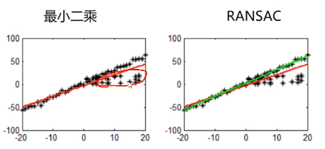

# Ransac算法

RANSAC（Random Sample Consensus，随机取样一致）是根据一组包含异常数据的样本数据集，计算出数据的数学模型参数，得到有效样本数据的算法。

一个直观的例子就是使用一条直线去拟合平面上的多个离散点（如下图）。最小二乘法会使用包括异常样本的所有的数据样本进行计算，得到拟合参数，但其会受到异常点的影响。而RANSAC就是为了解决这个问题。

RANSAC算法通过反复选择数据中的以组随机子集进行验证，概述如下：

- 随机选择一组点作为局内点，用这部分局内点拟合一个模型；
- 将所有满足该模型的点加入一个新的局内点集合；
- 使用新的局内点集合去拟合一个新的模型，并测试模型的准确度（即满足模型的点 占所有点的比例）；
- 重复步骤2、3，最终得到一个准确度达到预期的模型。

RANSAC常用于删除特征匹配过程中的异常点。