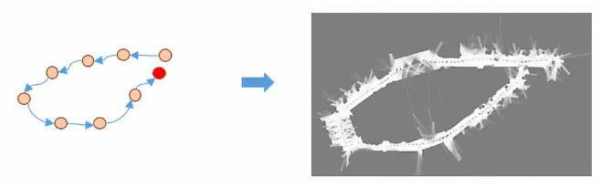
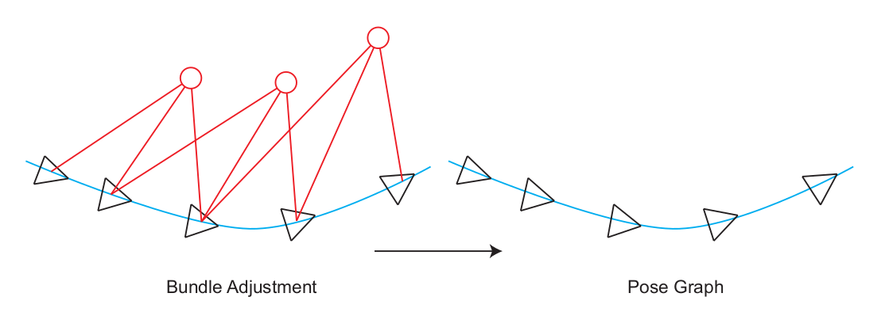

# 图优化

slam (simultaneous localization and mapping) 即时定位于建图

## 后端优化

利用回环检测和惯导先验位姿修正里程计位姿，而回环在此提供的是两帧之间的相对位姿

- 连续两帧之间的相对位姿观测（里程计）
- 闭环匹配得到的相对位姿观察（闭环检测）
- 组合导航提供的先验位姿估计（IMU）

1和2的观测构成了基于回环的位姿修正， 1和3的观测构成了基于先验观测的位姿修正，当然三者也可以结合使用，三者的关系是：2和3在1的基础上对位姿进行修正，这里对里程计的平滑性有一定要求

## 回环检测

> loop closure detection 消除累计误差

由于里程计帧之间的位姿估计有很多，因此积少成多，漂移最终累积特别大，就会导致机器人在达到初始位置是，观测显示已经回到初始位置，而位姿估计却显示与初始位置相差一段距离，如下图所示

在视觉SLAM问题中，位姿的估计往往是一个递推的过程，即由上一帧位姿解算当前帧位姿，因此其中的误差便这样一帧一帧的传递下去，也就是我们所说的累积误差。一个消除误差有效的办法是进行回环检测。回环检测判断机器人是否回到了先前经过的位置，如果检测到回环，它会把信息传递给后端进行优化处理。回环是一个比后端更加紧凑、准确的约束，这一约束条件可以形成一个拓扑一致的轨迹地图。如果能够检测到闭环，并对其优化，就可以让结果更加准确。

## 图优化算法

构建一个只有轨迹的图优化，而位姿节点之间的边，可以由两个关键帧之间通过特征匹配之后得到的运动估计来给定初始值。不同的是，一旦初始估计完成，我们就不再优化那些路标点的位置，而只关心所有的相机位姿之间的关系了. 节点即为关键帧的轨迹，边为通过帧间匹配得到的约束

- 构建图, 机器人位姿作为顶点,位姿间关系作为边
- 优化图, 调整机器人的位姿(顶点)来尽量满足边的约束,使得误差最小